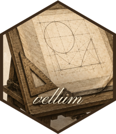
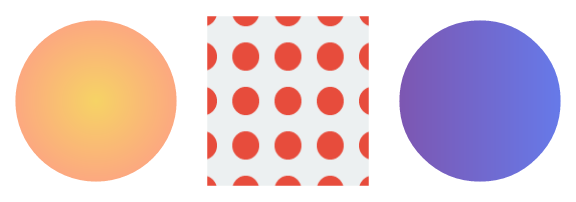
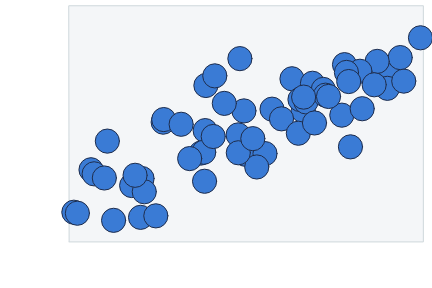
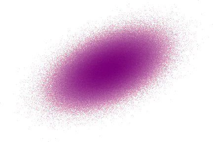

<!-- README.md is generated from README.Rmd. Please edit that file -->

```{r setup, include = FALSE}
knitr::opts_chunk$set(
  collapse = TRUE,
  comment = "#>",
  message = FALSE,
  warning = FALSE,
  fig.path = "man/figures/"
)
```

# vellum 

<!-- badges: start -->
[](https://github.com/r-vellum/vellum/actions/workflows/R-CMD-check.yaml)
<!-- badges: end -->

**vellum** is a low-level graphics framework for R, in the spirit of **grid**,
with a **Rust** backend. You describe a scene with a small, declarative R API;
the scene graph, unit/layout engine, and rendering all run in Rust; and the same
scene renders to **PNG, SVG, or PDF**.

It is the *foundation layer* a grammar of graphics builds on, the way grid
underlies ggplot2. It is not a plotting package itself; the
[vellumplot](https://github.com/r-vellum/vellumplot) grammar of graphics is built on
top of it.

```{r hello}
library(vellum)

vl_scene(width = 5, height = 2.4, bg = "white") |>
  draw(rect_grob(width = 0.94, height = 0.82,
                 gp = vl_gpar(fill = linear_gradient(c("#1b2a4a", "#3a7bd5")), col = NA))) |>
  draw(circle_grob(x = 0.16, y = 0.5, r = 0.28,
                   gp = vl_gpar(fill = "#f7c948", col = NA))) |>
  draw(text_grob("vellum", x = 0.62, y = 0.5,
                 gp = vl_gpar(fontsize = 64, col = "white", fontface = "bold"))) |>
  render("man/figures/README-hello.png")
```


A scene is built functionally: `vl_scene()` followed by a pipeline of `push()`,
`draw()`, and `pop()` over an immutable tree. It is rendered with `render()`,
which picks the backend from the file extension.

## What sets it apart

- **Rust backend, deterministic output.** Rendering runs in Rust
  ([tiny-skia](https://github.com/linebender/tiny-skia) for raster,
  [krilla](https://github.com/LaurenzV/krilla) for PDF) and is byte-stable, so
  output is reproducible and snapshot-testable.
- **One scene, three backends.** The *same* scene renders to PNG, SVG, and PDF
  with consistent geometry, via `render(scene, "plot.svg")` or
  `render(scene, "plot.pdf")`.
- **A retained scene graph, not immediate-mode drawing.** Because the scene is
  kept (not drawn-and-forgotten), vellum offers capabilities grid does not:
  **hit-testing** (`hit_test()` picks the topmost grob under a point) and named,
  **editable** nodes (`node_names()` / `get_node()` / `edit_node()`).
- **A modern paint model across all backends.** Linear & radial **gradients**,
  tiling **patterns**, alpha/luminance **masks**, and group opacity
  (`vl_viewport(alpha=)`).
- **Built-in big-data aggregation.** `datashade()` bins millions of points into a
  density raster in one pass, with no overplotting and no giant files.
- **Device-independent, faithful text.** Shaping runs through
  [textshaping](https://github.com/r-lib/textshaping) (which sits on
  [systemfonts](https://github.com/r-lib/systemfonts)) — the same stack as
  ragg/svglite — with per-glyph fallback, justification, rotation, and
  Markdown-style rich labels (`md()`: bold/italic, super/subscript, coloured spans).
- **Vectorised primitives and a flex layout engine.** Batched
  rects/circles/points/segments/text, nested viewports with rotation and
  arbitrary-path clipping, and a row/column layout solver with `"null"` (flexible)
  tracks.
- **Grid interop.** `as_vellum()` / `render_grid()` render an existing grid grob
  tree, including **ggplot2** and **lattice**, through the vellum backend.

## Installation

vellum compiles a Rust crate, so you need a **Rust toolchain**
(`cargo`/`rustc`) in addition to R. Then:

```r
# install.packages("pak")
pak::pak("r-vellum/vellum")
```

## Examples

### The paint model

Gradients, a tiling pattern, and a mask, composed with viewports:

```{r paint}
tile <- list(rect_grob(gp = vl_gpar(fill = "#ecf0f1", col = NA)),
             circle_grob(r = 0.32, gp = vl_gpar(fill = "#e74c3c", col = NA)))

vl_scene(6, 2.1, bg = "white") |>
  # radial gradient
  push(vl_viewport(x = 1/6, width = 1/3)) |>
    draw(circle_grob(r = 0.42, gp = vl_gpar(fill = radial_gradient(c("#f6d365", "#fda085")), col = NA))) |>
  pop() |>
  # tiling pattern
  push(vl_viewport(x = 3/6, width = 1/3)) |>
    draw(rect_grob(width = 0.84, height = 0.84,
                   gp = vl_gpar(fill = vl_pattern(tile, width = 0.22, height = 0.22), col = NA))) |>
  pop() |>
  # a linear gradient, clipped to a circular mask
  push(vl_viewport(x = 5/6, width = 1/3,
                mask = as_mask(circle_grob(r = 0.42, gp = vl_gpar(fill = "white", col = NA))))) |>
    draw(rect_grob(gp = vl_gpar(fill = linear_gradient(c("#7f53ac", "#647dee")), col = NA))) |>
  pop() |>
  render("man/figures/README-paint.png")
```



### A data scene with native coordinates

vellum is the layer a grammar builds on, so plots are assembled from primitives in
a viewport with its own `xscale` / `yscale` (`"native"` units):

```{r scatter}
set.seed(1)
x <- runif(60, 0, 10)
y <- 1.8 * x + rnorm(60, 0, 4)

vl_scene(4.5, 3, bg = "white") |>
  push(vl_viewport(x = 0.57, y = 0.57, width = 0.82, height = 0.82,
                xscale = c(0, 10), yscale = range(pretty(y)))) |>
    draw(rect_grob(gp = vl_gpar(fill = "#f4f6f8", col = "#cfd8dc"))) |>
    draw(points_grob(vl_unit(x, "native"), vl_unit(y, "native"), size = vl_unit(3.2, "mm"),
                     gp = vl_gpar(fill = "#3a7bd5", col = "#1b2a4a", lwd = 1))) |>
  pop() |>
  render("man/figures/README-scatter.png")
```



### A million points with `datashade()`

`datashade()` aggregates the points into a grid the size of the output raster,
counts how many land in each cell, and colours each cell by that count. Because
the work scales with the number of pixels rather than the number of points, it
draws millions of points quickly, shows true density instead of the solid blob
that overplotting produces, and keeps the output file small.

```{r datashade}
set.seed(2)
n <- 1e6
xx <- rnorm(n)
yy <- xx * 0.55 + rnorm(n)

vl_scene(4.5, 3, bg = "white") |>
  draw(datashade(xx, yy, width = 450, height = 300, colors = c("#fde0dd", "#7a0177"))) |>
  render("man/figures/README-datashade.png")
```



### One scene, three formats

```{r multi-backend, eval = FALSE}
s <- vl_scene(4, 3) |>
  draw(circle_grob(r = 0.3, gp = vl_gpar(fill = "tomato", col = NA)))

render(s, "out.png") # raster   (tiny-skia)
render(s, "out.svg") # vector   (hand-rolled SVG)
render(s, "out.pdf") # vector   (krilla)
```

## Relationship to grid and ggplot2

vellum sits at grid's level of the stack: units, viewports, grobs, layout, and
rendering, but with a Rust scene graph, multi-backend output, hit-testing, and a
modern paint model. It is **not** a grammar of graphics (no scales, stats, geoms,
or facets) — that is [vellumplot](https://github.com/r-vellum/vellumplot), which
compiles a plot spec into a vellum scene. To render *existing* grid / ggplot2 /
lattice output through the vellum backend, use `as_vellum()` / `render_grid()`.

## The vellum ecosystem

vellum is the backend of a small ecosystem of packages that share its scene
model:

- **[vellum](https://github.com/r-vellum/vellum)** — the parchment: the
  low-level graphics backend (this package).
- **[vellumplot](https://github.com/r-vellum/vellumplot)** — the pen: a pipe-first
  grammar of graphics that compiles a plot spec into a vellum scene.
- **[vellumwidget](https://github.com/r-vellum/vellumwidget)** — the annotation: client-side
  interactive HTML widgets for vellum scenes and vellumplot plots.
- **[vellumverse](https://github.com/r-vellum/vellumverse)** — installs and
  loads the whole ecosystem in one step.

## Development

vellum wires an R package to a Rust crate via
[extendr](https://extendr.github.io/) (crates are vendored for offline/CRAN
builds).

```r
rextendr::document() # compile the Rust backend + regenerate R wrappers
devtools::test()     # run the test suite
```
