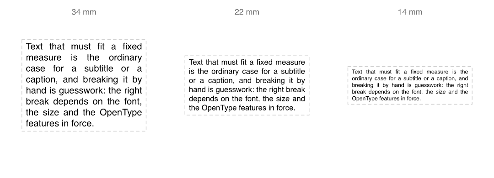
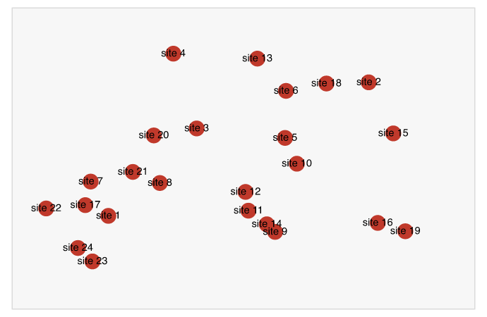
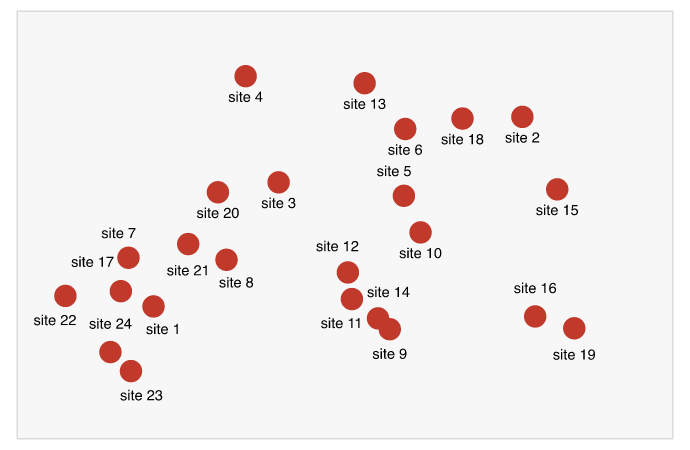
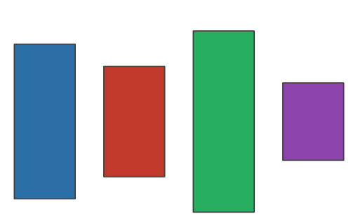
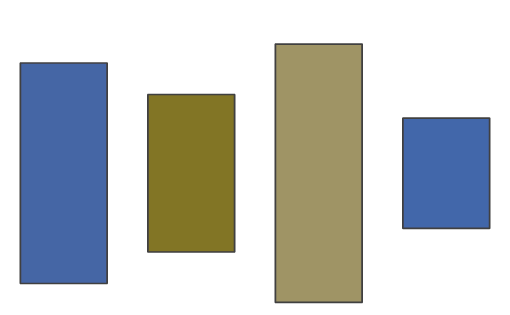
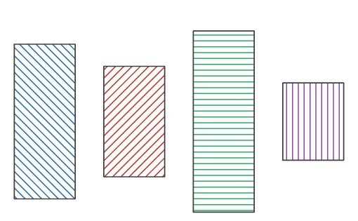

<!-- README.md is generated from README.Rmd. Please edit that file -->

```{r setup, include = FALSE}
knitr::opts_chunk$set(
  collapse = TRUE,
  comment = "#>",
  message = FALSE,
  warning = FALSE,
  fig.path = "man/figures/"
)
```

# vellum 

<!-- badges: start -->
[](https://github.com/r-vellum/vellum/actions/workflows/R-CMD-check.yaml)
<!-- badges: end -->

**vellum draws nothing until it knows exactly what it is drawing.**

Text is measured, layout is solved and every mark's position is resolved *before*
anything reaches a canvas — in process, with no device open. That one property is
where everything below comes from: a scene you can interrogate, wrap text inside,
move labels around in, lint, hash, diff and render three ways from a single solve.

It is a low-level graphics framework in the spirit of **grid** — units, viewports,
grobs, layout — and it is the foundation layer a grammar of graphics builds on,
not a plotting package itself. That grammar is
[vellumplot](https://github.com/r-vellum/vellumplot).

```{r hello, echo = FALSE}
library(vellum)

vl_scene(width = 5, height = 2.4, bg = "white") |>
  draw(rect_grob(width = 0.94, height = 0.82,
                 gp = vl_gpar(fill = linear_gradient(c("#1b2a4a", "#3a7bd5")), col = NA))) |>
  draw(circle_grob(x = 0.16, y = 0.5, r = 0.28,
                   gp = vl_gpar(fill = "#f7c948", col = NA))) |>
  draw(text_grob("vellum", x = 0.62, y = 0.5,
                 gp = vl_gpar(fontsize = 64, col = "white", fontface = "bold"))) |>
  render("man/figures/README-hello.png")
```


## Things a graphics engine usually cannot do

Each of these needs the geometry to exist *before* the draw. In a device-driven
stack it does not, which is why these are hard or impossible on top of grid.

**Ask the scene where everything landed.** One row per element — data key, mark,
panel, device-pixel box — with no device open and nothing drawn.

```{r readback}
plot <- vl_scene(4, 2, bg = "white") |>
  push(vl_viewport(name = "panel", xscale = c(0, 10), yscale = c(0, 10))) |>
  draw(points_grob(vl_unit(c(2, 5, 8), "native"), vl_unit(c(3, 7, 4), "native"),
                   key = paste0("site-", 1:3), name = "sites")) |>
  pop()

scene_model(plot)$elements[, c("key", "mark", "panel", "x0", "y0", "x1", "y1")]
```

**Fit text to a box.** Wrap to a measure, justify it, and shrink the font until
the block fits — each probe re-wraps, because the line breaks depend on the size.

```r
text_grob(caption, width = vl_unit(60, "mm"), height = vl_unit(20, "mm"),
          align = "justify", fit = TRUE)
```

**Move colliding labels apart, in the engine.** Solved in device pixels and
applied as an absolute offset, so faceted, polar and warped panels are all solved
*together*, in one pass, with no second compile.

```r
vl_repel(plot)                      # or vl_place(plot) for the answer alone
```

**Lint a figure before anyone sees it.** Static analysis for graphics: the label
too small to read at this size, the mark that will never be painted, the text
that will not contrast with what lands behind it.

```{r lint, message = TRUE}
vl_scene(4, 2, dpi = 96, bg = "white") |>
  draw(text_grob("n = 120", x = 0.1, y = 0.9, gp = vl_gpar(fontsize = 2.5),
                 name = "n_label")) |>
  draw(points_grob(2.4, 0.5, name = "stray_point")) |>
  draw(text_grob("watermark", gp = vl_gpar(fontsize = 22, col = "#F2F2F2"),
                 name = "watermark")) |>
  vl_lint()
```

**Treat a scene as a value.** Hash it, diff it, nest one inside another. A
structural diff is a far better regression test than an image diff, because it is
immune to the font stack:

```r
scene_hash(a) == scene_hash(b)
scene_diff(a, b)                    # what changed, not which pixels
```

**Ship output that is actually accessible.** Simulate colour-vision deficiency in
the render, encode redundantly with real hatch *geometry*, and emit a **tagged
PDF** whose structure tree a screen reader can navigate — from the same
`role`/`name` metadata that drives the SVG.

```r
render(plot, "check.png", cvd = "deuteranopia")
render(plot, "report.pdf")          # tagged, if the marks carry role/name
```

And more that has no device-driven equivalent: **text set along a curve**,
**boolean path operations** on real geometry, **contours** chained into
polylines, **SVG icon paths** as crisp vector markers, **stroke-to-outline**
expansion, **animated SVG**, **multi-page PDF**, and **font pinning** that makes
"identical pixels everywhere" checkable rather than merely claimed.

## How a scene is built

Functionally: `vl_scene()` then a pipeline of `push()`, `draw()` and `pop()` over
an immutable tree, rendered with `render()`, which picks the backend from the
file extension.

```{r builder, eval = FALSE}
library(vellum)

vl_scene(width = 5, height = 2.4, bg = "white") |>
  draw(rect_grob(width = 0.94, height = 0.82,
                 gp = vl_gpar(fill = linear_gradient(c("#1b2a4a", "#3a7bd5")), col = NA))) |>
  draw(circle_grob(x = 0.16, y = 0.5, r = 0.28,
                   gp = vl_gpar(fill = "#f7c948", col = NA))) |>
  draw(text_grob("vellum", x = 0.62, y = 0.5,
                 gp = vl_gpar(fontsize = 64, col = "white", fontface = "bold"))) |>
  render("hello.png")
```

## The rest of the engine

These are the parts that make the above possible, or that you would expect of a
graphics engine and would miss if they were absent.

- **Layout is solved once, not once per device.** The *same* solved scene is
  walked for each backend, so `render(scene, "plot.png" | "plot.svg" | "plot.pdf")`
  agree on geometry rather than each re-solving it against their own font metrics.
  Output is byte-stable, so figures are snapshot-testable. Where a backend cannot
  honour something it **says so** rather than silently dropping it.
- **Text that matches the rest of R.** Shaping runs through
  [textshaping](https://github.com/r-lib/textshaping) on
  [systemfonts](https://github.com/r-lib/systemfonts) — the stack ragg and
  svglite use — with per-glyph fallback, OpenType features (`tnum`, `smcp`,
  `onum`), haloed text, and Markdown-style rich labels (`md()`).
  `vl_strwidth()` measures without opening a device.
- **A modern paint model, everywhere.** Linear and radial **gradients** (on
  strokes too), tiling **patterns**, real hatch **geometry**, alpha and luminance
  **masks**, group opacity, blur, drop shadow and glow.
- **Named, editable nodes.** `node_names()` / `get_node()` / `edit_node()` work
  much as `grid.ls()` / `getGrob()` / `editGrob()` do — the difference is that the
  tree is a value you hold rather than device state you recover, so an edit
  returns a new scene and nothing has to be undrawn.
- **Big data without the blob.** `datashade()` bins millions of points into a
  density raster in one pass — cost scales with output pixels, not row count —
  and rasterises line segments with Wu antialiasing rather than binning endpoints.
- **Geometry services.** Boolean path ops, convex and concave hulls, buffering,
  contours, path simplification, stroke-to-outline, and true-geometry hit-testing
  (`vl_nearest()`), because a diagonal's bounding box is a poor description of it.
- **Vectorised primitives and a flex layout engine.** Batched
  rects/circles/points/segments/text, nested viewports with rotation and
  arbitrary-path clipping, and a row/column layout solver with `"null"` tracks.
- **Grid interop.** `as_vellum()` / `render_grid()` render an existing grid grob
  tree, including **ggplot2** and **lattice**, through the vellum backend.

The engine ([tiny-skia](https://github.com/linebender/tiny-skia) for raster, an
SVG writer, [krilla](https://github.com/LaurenzV/krilla) for PDF) is written in
**Rust** because owning the measuring and rasterising stack is what all of the
above requires — not as a performance claim. That is also why installing from
source needs `cargo`.

## Installation

vellum compiles a Rust crate, so you need a **Rust toolchain**
(`cargo`/`rustc`) in addition to R. Then:

```r
# install.packages("pak")
pak::pak("r-vellum/vellum")
```

## Examples

### Typography with actual metrics

The same caption wrapped to a fixed measure and auto-fitted to three box heights,
and a label set along a curve. None of this is expressible without measuring text
up front.

```{r typography, echo = FALSE}
cap <- paste("Text that must fit a fixed measure is the ordinary case for a",
             "subtitle or a caption, and breaking it by hand is guesswork:",
             "the right break depends on the font, the size and the",
             "OpenType features in force.")

s <- vl_scene(7.2, 2.6, dpi = 150, bg = "white")
for (i in seq_along(hs <- c(34, 22, 14))) {
  x <- c(0.17, 0.5, 0.83)[i]
  s <- s |>
    draw(rect_grob(x = x, y = 0.52, width = vl_unit(46, "mm"),
                   height = vl_unit(hs[i], "mm"),
                   gp = vl_gpar(fill = NA, col = "grey82", lty = "dashed"))) |>
    draw(text_grob(cap, x = x, y = 0.52, width = vl_unit(43, "mm"),
                   height = vl_unit(hs[i] - 2, "mm"), fit = TRUE, align = "justify",
                   gp = vl_gpar(fontsize = 11))) |>
    draw(text_grob(paste0(hs[i], " mm"), x = x, y = 0.93,
                   gp = vl_gpar(fontsize = 8.5, col = "grey45")))
}
render(s, "man/figures/README-typography.png")

wx <- seq(0.03, 0.97, length.out = 200)
render(
  vl_scene(7.2, 1.1, dpi = 150, bg = "#1b2a4a") |>
    draw(text_path_grob("type set along whatever curve you hand it",
                        x = wx, y = 0.5 + 0.26 * sin(wx * 2.2 * pi),
                        just = "left", offset = 4,
                        gp = vl_gpar(fontsize = 15, col = "white",
                                     halo_col = "#1b2a4a", halo_width = 2))),
  "man/figures/README-textpath.png"
)
```




### Labels that move themselves out of the way

`vl_repel()` solves collisions over the *resolved* geometry — every panel at
once, in one pass. Left: as authored. Right: repelled.

```{r repel, echo = FALSE}
set.seed(3)
n <- 24
rx <- runif(n) * 0.88 + 0.06
ry <- runif(n) * 0.8 + 0.12
scatter <- function() {
  vl_scene(4.6, 3, dpi = 150, bg = "white") |>
    push(vl_viewport(name = "p", width = 0.95, height = 0.95)) |>
    draw(rect_grob(gp = vl_gpar(fill = "grey97", col = "grey86"))) |>
    draw(points_grob(rx, ry, size = vl_unit(1.9, "mm"),
                     gp = vl_gpar(fill = "#C0392B", col = NA), name = "pts")) |>
    draw(text_grob(paste0("site ", seq_len(n)), x = rx, y = ry,
                   gp = vl_gpar(fontsize = 7), name = "lab")) |>
    pop()
}
render(scatter(), "man/figures/README-repel-before.png")
render(vl_repel(scatter(), padding = 0.5), "man/figures/README-repel-after.png")
```




### Accessible by construction

A palette checked against colour-vision deficiency in the render, and the same
categories re-encoded with hatch *geometry* — crisp at any zoom, correct in
print, and readable in greyscale.

```{r a11y, echo = FALSE}
pal <- c("#2C6FA6", "#C0392B", "#27AE60", "#8E44AD")
bars <- function(fills) {
  s <- vl_scene(3.4, 2.1, dpi = 150, bg = "white")
  for (i in 1:4) {
    s <- draw(s, rect_grob(x = (i - 0.5) / 4, y = 0.45,
                           width = 0.17, height = c(0.7, 0.5, 0.82, 0.35)[i],
                           gp = vl_gpar(fill = fills[[i]], col = "grey25")))
  }
  s
}
render(bars(as.list(pal)), "man/figures/README-a11y-colour.png")
render(bars(as.list(pal)), "man/figures/README-a11y-cvd.png", cvd = "deuteranopia")
render(bars(lapply(seq_along(pal), function(i)
  vl_hatch(angle = c(45, -45, 0, 90)[i], spacing = 4, col = pal[i]))),
  "man/figures/README-a11y-hatch.png")
```





*As authored · as a deuteranopic reader sees it · re-encoded with hatching.*

### The paint model

Gradients, a tiling pattern, and a mask, composed with viewports:

```{r paint}
tile <- list(rect_grob(gp = vl_gpar(fill = "#ecf0f1", col = NA)),
             circle_grob(r = 0.32, gp = vl_gpar(fill = "#e74c3c", col = NA)))

vl_scene(6, 2.1, bg = "white") |>
  # radial gradient
  push(vl_viewport(x = 1/6, width = 1/3)) |>
    draw(circle_grob(r = 0.42, gp = vl_gpar(fill = radial_gradient(c("#f6d365", "#fda085")), col = NA))) |>
  pop() |>
  # tiling pattern
  push(vl_viewport(x = 3/6, width = 1/3)) |>
    draw(rect_grob(width = 0.84, height = 0.84,
                   gp = vl_gpar(fill = vl_pattern(tile, width = 0.22, height = 0.22), col = NA))) |>
  pop() |>
  # a linear gradient, clipped to a circular mask
  push(vl_viewport(x = 5/6, width = 1/3,
                mask = as_mask(circle_grob(r = 0.42, gp = vl_gpar(fill = "white", col = NA))))) |>
    draw(rect_grob(gp = vl_gpar(fill = linear_gradient(c("#7f53ac", "#647dee")), col = NA))) |>
  pop() |>
  render("man/figures/README-paint.png")
```


### A data scene with native coordinates

vellum is the layer a grammar builds on, so plots are assembled from primitives in
a viewport with its own `xscale` / `yscale` (`"native"` units):

```{r scatter}
set.seed(1)
x <- runif(60, 0, 10)
y <- 1.8 * x + rnorm(60, 0, 4)

vl_scene(4.5, 3, bg = "white") |>
  push(vl_viewport(x = 0.57, y = 0.57, width = 0.82, height = 0.82,
                xscale = c(0, 10), yscale = range(pretty(y)))) |>
    draw(rect_grob(gp = vl_gpar(fill = "#f4f6f8", col = "#cfd8dc"))) |>
    draw(points_grob(vl_unit(x, "native"), vl_unit(y, "native"), size = vl_unit(3.2, "mm"),
                     gp = vl_gpar(fill = "#3a7bd5", col = "#1b2a4a", lwd = 1))) |>
  pop() |>
  render("man/figures/README-scatter.png")
```


### A million points with `datashade()`

`datashade()` aggregates the points into a grid the size of the output raster,
counts how many land in each cell, and colours each cell by that count. Because
the work scales with the number of pixels rather than the number of points, it
draws millions of points quickly, shows true density instead of the solid blob
that overplotting produces, and keeps the output file small.

```{r datashade}
set.seed(2)
n <- 1e6
xx <- rnorm(n)
yy <- xx * 0.55 + rnorm(n)

vl_scene(4.5, 3, bg = "white") |>
  draw(datashade(xx, yy, width = 450, height = 300, colors = c("#fde0dd", "#7a0177"))) |>
  render("man/figures/README-datashade.png")
```


### One scene, three formats

```{r multi-backend, eval = FALSE}
s <- vl_scene(4, 3) |>
  draw(circle_grob(r = 0.3, gp = vl_gpar(fill = "tomato", col = NA)))

render(s, "out.png") # raster   (tiny-skia)
render(s, "out.svg") # vector   (hand-rolled SVG)
render(s, "out.pdf") # vector   (krilla)
```

## Relationship to grid and ggplot2

vellum sits at grid's level of the stack: units, viewports, grobs, layout, and
rendering. What it adds is device-independent measurement (so layout is solved
once, not once per output format), geometry read-back (`scene_model()`,
`hit_test()`), a modern paint model, and built-in aggregation for large data. It is **not** a grammar of graphics (no scales, stats, geoms,
or facets) — that is [vellumplot](https://github.com/r-vellum/vellumplot), which
compiles a plot spec into a vellum scene. To render *existing* grid / ggplot2 /
lattice output through the vellum backend, use `as_vellum()` / `render_grid()`.

## The vellum ecosystem

Four packages sharing one scene model. The seam between them is the scene
itself: a value each layer can pass on, query, or annotate.

- **[vellum](https://github.com/r-vellum/vellum)** — *the parchment.* The
  low-level graphics engine (this package).
- **[vellumplot](https://github.com/r-vellum/vellumplot)** — *the pen.* A
  pipe-first grammar of graphics that compiles a plot spec into a vellum scene.
- **[vellumwidget](https://github.com/r-vellum/vellumwidget)** — *the
  annotation.* Interactive HTML widgets, built entirely client-side on
  `scene_model()`'s geometry — hover, brush, lasso, linked zoom, and crosstalk,
  with no server round trip.
- **[vellumverse](https://github.com/r-vellum/vellumverse)** — installs and loads
  the whole ecosystem in one step.

`vellumwidget` is a good illustration of what the read-back buys: it adds no
drawing code at all. It renders the scene's SVG, reads the element table, and
attaches behaviour.

## Development

vellum wires an R package to a Rust crate via
[extendr](https://extendr.github.io/) (crates are vendored for offline/CRAN
builds).

```r
rextendr::document() # compile the Rust backend + regenerate R wrappers
devtools::test()     # run the test suite
```
