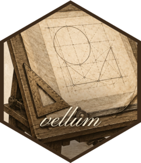
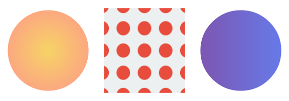
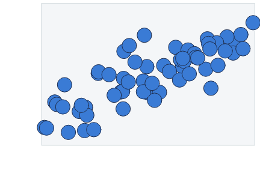
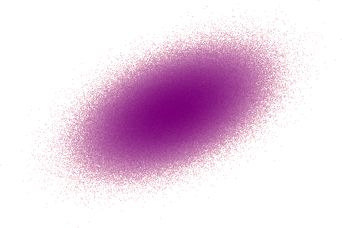

<!-- README.md is generated from README.Rmd. Please edit that file -->

# vellum 

<!-- badges: start -->

[](https://github.com/r-vellum/vellum/actions/workflows/R-CMD-check.yaml)
<!-- badges: end -->

**vellum** is a low-level graphics framework for R, in the spirit of
**grid**. You describe a scene with a small declarative API, and because
vellum measures text and solves layout itself rather than asking a
device, the finished scene can **tell you where it put everything**: one
row per drawn element, with its data key and its resolved device-pixel
box (`scene_model()`), plus picking by point (`hit_test()`). Layout is
solved once, so the same scene renders to **PNG, SVG, or PDF** with the
same geometry rather than three devices each re-solving it.

Owning the measurement and rendering stack is what that requires, which
is why the engine is written in **Rust** (and why installing from source
needs `cargo`).

It is the *foundation layer* a grammar of graphics builds on, the way
grid underlies ggplot2. It is not a plotting package itself; the
[vellumplot](https://github.com/r-vellum/vellumplot) grammar of graphics
is built on top of it.

``` r
library(vellum)

vl_scene(width = 5, height = 2.4, bg = "white") |>
  draw(rect_grob(width = 0.94, height = 0.82,
                 gp = vl_gpar(fill = linear_gradient(c("#1b2a4a", "#3a7bd5")), col = NA))) |>
  draw(circle_grob(x = 0.16, y = 0.5, r = 0.28,
                   gp = vl_gpar(fill = "#f7c948", col = NA))) |>
  draw(text_grob("vellum", x = 0.62, y = 0.5,
                 gp = vl_gpar(fontsize = 64, col = "white", fontface = "bold"))) |>
  render("man/figures/README-hello.png")
```


A scene is built functionally: `vl_scene()` followed by a pipeline of
`push()`, `draw()`, and `pop()` over an immutable tree. It is rendered
with `render()`, which picks the backend from the file extension.

## What sets it apart

- **The scene reports its own geometry.** `scene_model()` returns one
  row per drawn element — its data key, mark kind, enclosing panel, and
  resolved device-pixel box — plus each panel’s pixel rectangle and
  native ranges. `hit_test()` answers the inverse question, picking the
  topmost node under a point through a pick-buffer compiled by the same
  code that drew the scene, so it cannot disagree with the picture. This
  is the part with no counterpart in grid, and the seam that tooltips,
  brushing, accessibility, and layout debugging are all built on.
- **Layout is solved once, not once per device.** Because text is
  measured in process, layout does not need an open device, and the
  *same* solved scene is walked for each backend:
  `render(scene, "plot.png" | "plot.svg" | "plot.pdf")` agree on
  geometry rather than each re-solving it against their own font
  metrics. Raster and PDF output are byte-stable, so figures are
  reproducible and snapshot-testable.
- **Named, editable nodes.** `node_names()` / `get_node()` /
  `edit_node()` work much as `grid.ls()` / `getGrob()` / `editGrob()` do
  — the difference is that the tree is a value you hold rather than
  device state you recover, so an edit returns a new scene and nothing
  has to be undrawn.
- **Built-in big-data aggregation.** `datashade()` bins millions of
  points into a density raster in one pass, so cost scales with output
  pixels rather than row count, with no overplotting and no giant vector
  files.
- **Text that matches the rest of R.** Shaping runs through
  [textshaping](https://github.com/r-lib/textshaping) on
  [systemfonts](https://github.com/r-lib/systemfonts) — the stack ragg
  and svglite use — with per-glyph fallback, justification, rotation,
  and Markdown-style rich labels (`md()`: bold/italic, super/subscript,
  coloured spans). `vl_strwidth()` measures without opening a device.
- **A modern paint model across all backends.** Linear & radial
  **gradients**, tiling **patterns**, alpha/luminance **masks**, and
  group opacity (`vl_viewport(alpha=)`).
- **Vectorised primitives and a flex layout engine.** Batched
  rects/circles/points/segments/text, nested viewports with rotation and
  arbitrary-path clipping, and a row/column layout solver with `"null"`
  (flexible) tracks.
- **Grid interop.** `as_vellum()` / `render_grid()` render an existing
  grid grob tree, including **ggplot2** and **lattice**, through the
  vellum backend.

The engine ([tiny-skia](https://github.com/linebender/tiny-skia) for
raster, an SVG writer, [krilla](https://github.com/LaurenzV/krilla) for
PDF) is written in Rust because owning the measuring and rasterising
stack is what the first two points require — not as a performance claim.

## Installation

vellum compiles a Rust crate, so you need a **Rust toolchain**
(`cargo`/`rustc`) in addition to R. Then:

``` r
# install.packages("pak")
pak::pak("r-vellum/vellum")
```

## Examples

### The paint model

Gradients, a tiling pattern, and a mask, composed with viewports:

``` r
tile <- list(rect_grob(gp = vl_gpar(fill = "#ecf0f1", col = NA)),
             circle_grob(r = 0.32, gp = vl_gpar(fill = "#e74c3c", col = NA)))

vl_scene(6, 2.1, bg = "white") |>
  # radial gradient
  push(vl_viewport(x = 1/6, width = 1/3)) |>
    draw(circle_grob(r = 0.42, gp = vl_gpar(fill = radial_gradient(c("#f6d365", "#fda085")), col = NA))) |>
  pop() |>
  # tiling pattern
  push(vl_viewport(x = 3/6, width = 1/3)) |>
    draw(rect_grob(width = 0.84, height = 0.84,
                   gp = vl_gpar(fill = vl_pattern(tile, width = 0.22, height = 0.22), col = NA))) |>
  pop() |>
  # a linear gradient, clipped to a circular mask
  push(vl_viewport(x = 5/6, width = 1/3,
                mask = as_mask(circle_grob(r = 0.42, gp = vl_gpar(fill = "white", col = NA))))) |>
    draw(rect_grob(gp = vl_gpar(fill = linear_gradient(c("#7f53ac", "#647dee")), col = NA))) |>
  pop() |>
  render("man/figures/README-paint.png")
```



### A data scene with native coordinates

vellum is the layer a grammar builds on, so plots are assembled from
primitives in a viewport with its own `xscale` / `yscale` (`"native"`
units):

``` r
set.seed(1)
x <- runif(60, 0, 10)
y <- 1.8 * x + rnorm(60, 0, 4)

vl_scene(4.5, 3, bg = "white") |>
  push(vl_viewport(x = 0.57, y = 0.57, width = 0.82, height = 0.82,
                xscale = c(0, 10), yscale = range(pretty(y)))) |>
    draw(rect_grob(gp = vl_gpar(fill = "#f4f6f8", col = "#cfd8dc"))) |>
    draw(points_grob(vl_unit(x, "native"), vl_unit(y, "native"), size = vl_unit(3.2, "mm"),
                     gp = vl_gpar(fill = "#3a7bd5", col = "#1b2a4a", lwd = 1))) |>
  pop() |>
  render("man/figures/README-scatter.png")
```



### A million points with `datashade()`

`datashade()` aggregates the points into a grid the size of the output
raster, counts how many land in each cell, and colours each cell by that
count. Because the work scales with the number of pixels rather than the
number of points, it draws millions of points quickly, shows true
density instead of the solid blob that overplotting produces, and keeps
the output file small.

``` r
set.seed(2)
n <- 1e6
xx <- rnorm(n)
yy <- xx * 0.55 + rnorm(n)

vl_scene(4.5, 3, bg = "white") |>
  draw(datashade(xx, yy, width = 450, height = 300, colors = c("#fde0dd", "#7a0177"))) |>
  render("man/figures/README-datashade.png")
```



### One scene, three formats

``` r
s <- vl_scene(4, 3) |>
  draw(circle_grob(r = 0.3, gp = vl_gpar(fill = "tomato", col = NA)))

render(s, "out.png") # raster   (tiny-skia)
render(s, "out.svg") # vector   (hand-rolled SVG)
render(s, "out.pdf") # vector   (krilla)
```

## Relationship to grid and ggplot2

vellum sits at grid’s level of the stack: units, viewports, grobs,
layout, and rendering. What it adds is device-independent measurement
(so layout is solved once, not once per output format), geometry
read-back (`scene_model()`, `hit_test()`), a modern paint model, and
built-in aggregation for large data. It is **not** a grammar of graphics
(no scales, stats, geoms, or facets) — that is
[vellumplot](https://github.com/r-vellum/vellumplot), which compiles a
plot spec into a vellum scene. To render *existing* grid / ggplot2 /
lattice output through the vellum backend, use `as_vellum()` /
`render_grid()`.

## The vellum ecosystem

vellum is the backend of a small ecosystem of packages that share its
scene model:

- **[vellum](https://github.com/r-vellum/vellum)** — the parchment: the
  low-level graphics backend (this package).
- **[vellumplot](https://github.com/r-vellum/vellumplot)** — the pen: a
  pipe-first grammar of graphics that compiles a plot spec into a vellum
  scene.
- **[vellumwidget](https://github.com/r-vellum/vellumwidget)** — the
  annotation: client-side interactive HTML widgets for vellum scenes and
  vellumplot plots.
- **[vellumverse](https://github.com/r-vellum/vellumverse)** — installs
  and loads the whole ecosystem in one step.

## Development

vellum wires an R package to a Rust crate via
[extendr](https://extendr.github.io/) (crates are vendored for
offline/CRAN builds).

``` r
rextendr::document() # compile the Rust backend + regenerate R wrappers
devtools::test()     # run the test suite
```
