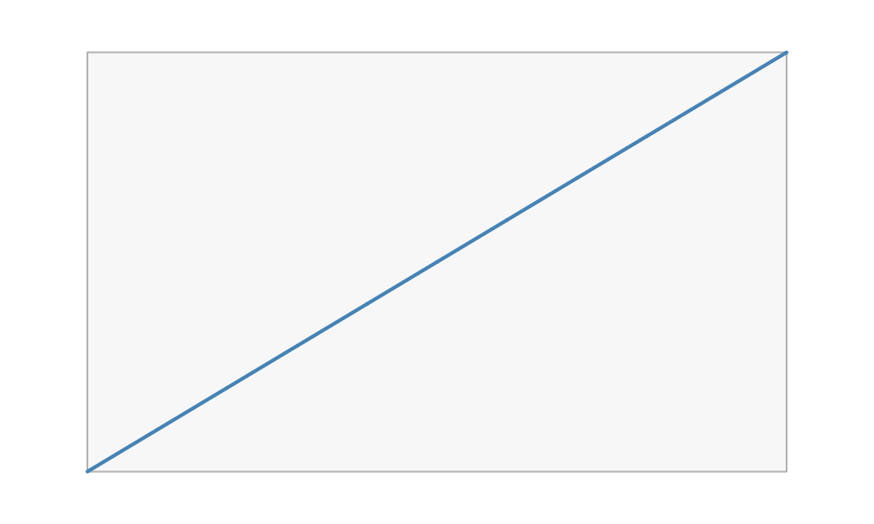

# Coming from grid

vellum sits at grid’s level of the stack: units, viewports, grobs,
layout, and rendering. If you know grid, most concepts carry over
directly. This guide maps the vocabulary and then flags the handful of
places where vellum works differently on purpose.

## The concept map

| grid | vellum | notes |
|----|----|----|
| [`grid.newpage()`](https://rdrr.io/r/grid/grid.newpage.html) | [`vl_scene()`](https://r-vellum.github.io/vellum/reference/vl_scene.md) | vellum’s scene also fixes page size, background, and dpi up front |
| `unit(1, "native")` | `vl_unit(1, "native")` | same idea; each element carries its own unit |
| [`viewport()`](https://rdrr.io/r/grid/viewport.html) | [`vl_viewport()`](https://r-vellum.github.io/vellum/reference/vl_viewport.md) | region with its own `xscale` / `yscale` |
| [`pushViewport()`](https://rdrr.io/r/grid/viewports.html) / [`popViewport()`](https://rdrr.io/r/grid/viewports.html) | [`push()`](https://r-vellum.github.io/vellum/reference/vl_scene.md) / [`pop()`](https://r-vellum.github.io/vellum/reference/vl_scene.md) | functional: they take and return a scene, no global stack |
| [`grid.rect()`](https://rdrr.io/r/grid/grid.rect.html), [`grid.circle()`](https://rdrr.io/r/grid/grid.circle.html), … | [`rect_grob()`](https://r-vellum.github.io/vellum/reference/grob.md), [`circle_grob()`](https://r-vellum.github.io/vellum/reference/grob.md), … plus [`draw()`](https://r-vellum.github.io/vellum/reference/vl_scene.md) | the constructor builds a value; [`draw()`](https://r-vellum.github.io/vellum/reference/vl_scene.md) adds it |
| [`rectGrob()`](https://rdrr.io/r/grid/grid.rect.html), [`gTree()`](https://rdrr.io/r/grid/grid.grob.html) | [`rect_grob()`](https://r-vellum.github.io/vellum/reference/grob.md), the scene tree | grobs are immutable S7 values |
| [`gpar()`](https://rdrr.io/r/grid/gpar.html) | [`vl_gpar()`](https://r-vellum.github.io/vellum/reference/vl_gpar.md) | familiar fields; `fill` also accepts gradients |
| [`grid.layout()`](https://rdrr.io/r/grid/grid.layout.html) | [`grid_layout()`](https://r-vellum.github.io/vellum/reference/vl_viewport.md) | flexible `"null"` tracks work the same |
| [`grid.ls()`](https://rdrr.io/r/grid/grid.ls.html) / [`grid.get()`](https://rdrr.io/r/grid/grid.get.html) | [`node_names()`](https://r-vellum.github.io/vellum/reference/node_names.md) / [`get_node()`](https://r-vellum.github.io/vellum/reference/node_names.md) | list and read nodes by `name` |
| [`grid.edit()`](https://rdrr.io/r/grid/grid.edit.html) / [`editGrob()`](https://rdrr.io/r/grid/grid.edit.html) | [`edit_node()`](https://r-vellum.github.io/vellum/reference/node_names.md) | [`editGrob()`](https://rdrr.io/r/grid/grid.edit.html) also copies; [`grid.edit()`](https://rdrr.io/r/grid/grid.edit.html) mutates the display list, [`edit_node()`](https://r-vellum.github.io/vellum/reference/node_names.md) never does |
| [`grid.grabExpr()`](https://rdrr.io/r/grid/grid.grab.html) / display list | the retained scene | the tree is the model, not something you recover from a device |
| [`grid.locator()`](https://rdrr.io/r/grid/grid.locator.html) | [`hit_test()`](https://r-vellum.github.io/vellum/reference/hit_test.md) | picking from a pick-buffer, not one interactive click |
| (no counterpart) | [`scene_model()`](https://r-vellum.github.io/vellum/reference/scene_model.md) | per-element identity plus resolved device-pixel bbox |
| device ([`png()`](https://rdrr.io/r/grDevices/png.html), [`pdf()`](https://rdrr.io/r/grDevices/pdf.html), …) | `render(scene, path)` | the extension picks the backend |

## Side by side

A minimal grid plot and its vellum translation. In grid:

``` r

library(grid)
grid.newpage()
pushViewport(viewport(width = 0.8, height = 0.8,
                      xscale = c(0, 10), yscale = c(0, 20)))
grid.rect(gp = gpar(fill = "grey97", col = "grey70"))
grid.lines(x = unit(0:10, "native"), y = unit((0:10) * 2, "native"),
           gp = gpar(col = "steelblue", lwd = 2))
popViewport()
```

The same scene in vellum:

``` r

vl_scene(5, 3, bg = "white") |>
  push(vl_viewport(width = 0.8, height = 0.8,
                xscale = c(0, 10), yscale = c(0, 20))) |>
  draw(rect_grob(gp = vl_gpar(fill = "grey97", col = "grey70"))) |>
  draw(lines_grob(x = vl_unit(0:10, "native"), y = vl_unit((0:10) * 2, "native"),
                  gp = vl_gpar(col = "steelblue", lwd = 2))) |>
  pop()
```



The shapes are the same; the difference is that the vellum version is
one expression that returns a scene value, with no global device or
viewport stack mutated along the way.

## What is different, and why

### The builder is functional, not stateful

grid keeps a global viewport stack and a display list:
[`pushViewport()`](https://rdrr.io/r/grid/viewports.html) mutates state,
and each `grid.*` call paints into the current device. vellum’s
[`push()`](https://r-vellum.github.io/vellum/reference/vl_scene.md),
[`draw()`](https://r-vellum.github.io/vellum/reference/vl_scene.md), and
[`pop()`](https://r-vellum.github.io/vellum/reference/vl_scene.md) each
take a scene and return a new one. There is no “current viewport” to
lose track of, the pipe *is* the tree, and a scene is an ordinary value
you can store, pass around, and branch from.

### Metrics are eager, so there is no draw-time hook protocol

grid cannot know a grob’s size until a device and viewport exist at draw
time, which is why it has lazy units and the `makeContext` /
`makeContent` / `widthDetails` hook protocol, and why it replays the
whole display list on resize. vellum resolves text and object metrics in
process, up front, so a grob knows its extent when you build it. You
measure with
[`vl_strwidth()`](https://r-vellum.github.io/vellum/reference/vl_strwidth.md)
or size a unit by a grob’s extent with
[`grobwidth()`](https://r-vellum.github.io/vellum/reference/grobwidth.md)
/
[`grobheight()`](https://r-vellum.github.io/vellum/reference/grobwidth.md)
immediately, without an open device.

### Units are records, not expression trees

A grid unit defers its arithmetic: `unit(1, "npc") - unit(2, "mm")` is
stored as `sum(1npc, -2mm)` and evaluated when a device and viewport
exist. A vellum unit is a flat record — a value, a base code, and an
absolute millimetre offset — so arithmetic reduces at construction
wherever it can.

``` r

vl_unit(10, "mm") + vl_unit(1, "in")     # absolute + absolute -> mm
#> <vellum_unit[1]>
#> [1] 35.4mm
vl_unit(1, "native") + vl_unit(2, "mm")  # a compound unit: base + offset
#> <vellum_unit[1]>
#> [1] 1native+2mm
vl_unit(1:3, "cm") * 2                   # scaling is fine
#> <vellum_unit[3]>
#> [1] 20mm 40mm 60mm
```

The third form is the one worth knowing. A position base plus an
absolute is kept as a *compound* unit that resolves as “the data (or
npc) position, displaced by exactly this many millimetres” at any scale,
aspect, or dpi — which is the case most grid code that mixes units
actually wants.

The one thing grid expresses and vellum does not is a mix of two
*different* position bases (`"npc"` plus `"native"`), because that
cannot reduce to a single record without a device. It errors, with a
message naming the legal forms. Put the normalised part in the viewport
and the data part in the coordinate, or pre-resolve to absolute units.

### The tree is a value, and it can report geometry

grid retains its scene as well, so this is a difference of degree for
the inspect-and-edit half:
[`grid.ls()`](https://rdrr.io/r/grid/grid.ls.html),
[`grid.get()`](https://rdrr.io/r/grid/grid.get.html),
[`grid.edit()`](https://rdrr.io/r/grid/grid.edit.html) and
[`editGrob()`](https://rdrr.io/r/grid/grid.edit.html) already let you
rewrite a plot after the fact, and
[`node_names()`](https://r-vellum.github.io/vellum/reference/node_names.md),
[`get_node()`](https://r-vellum.github.io/vellum/reference/node_names.md)
and
[`edit_node()`](https://r-vellum.github.io/vellum/reference/node_names.md)
are the counterparts here. The difference is that vellum’s tree is an
immutable value rather than device state, so there is no
[`grid.force()`](https://rdrr.io/r/grid/grid.force.html) step and no
in-place mutation of a display list.

The half with no grid counterpart is geometry read-back:
[`hit_test()`](https://r-vellum.github.io/vellum/reference/hit_test.md)
picks the topmost node under a point, and
[`scene_model()`](https://r-vellum.github.io/vellum/reference/scene_model.md)
returns every drawn element with its resolved device-pixel bounding box.
See
[`vignette("retained-mode")`](https://r-vellum.github.io/vellum/articles/retained-mode.md)
for what that enables.

### `vl_gpar` inherits, but there is no cascade

[`vl_gpar()`](https://r-vellum.github.io/vellum/reference/vl_gpar.md)
inheritance works as in grid: a field left `NULL` is inherited from the
enclosing viewport, and `alpha` multiplies down the tree. vellum does
not add a CSS-like cascade with selectors or theme objects at this
layer; that is a grammar-layer concern.

## Do I have to rewrite my grid code?

Not necessarily. If you already have grid, ggplot2, or lattice output,
you can render it *through* vellum’s backend without porting anything,
using
[`as_vellum()`](https://r-vellum.github.io/vellum/reference/as_vellum.md)
and
[`render_grid()`](https://r-vellum.github.io/vellum/reference/as_vellum.md).
See
[`vignette("grid-interop")`](https://r-vellum.github.io/vellum/articles/grid-interop.md).
Rewriting in the native API is worth it when you want the retained-tree
features (naming, editing, hit-testing) or deterministic multi-backend
output. \`\`\`
