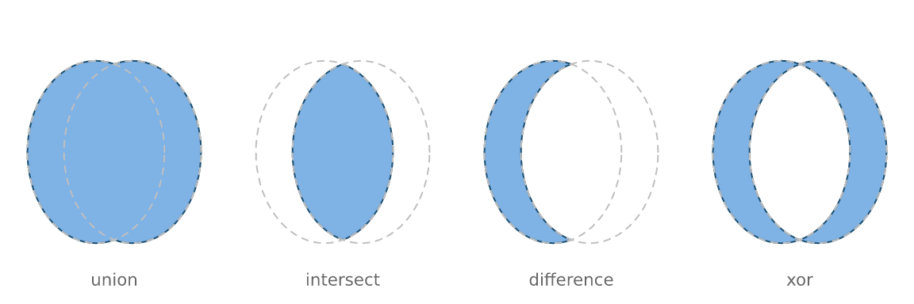
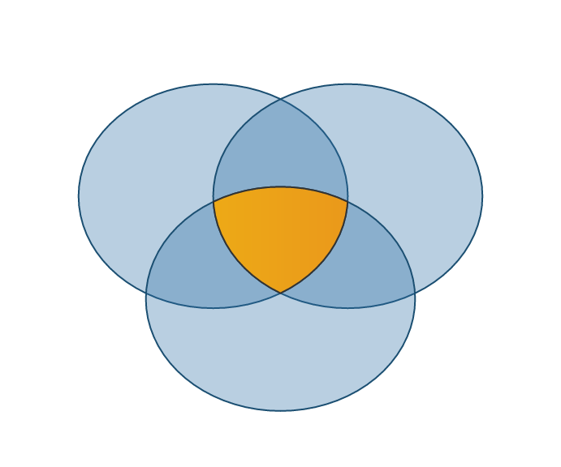
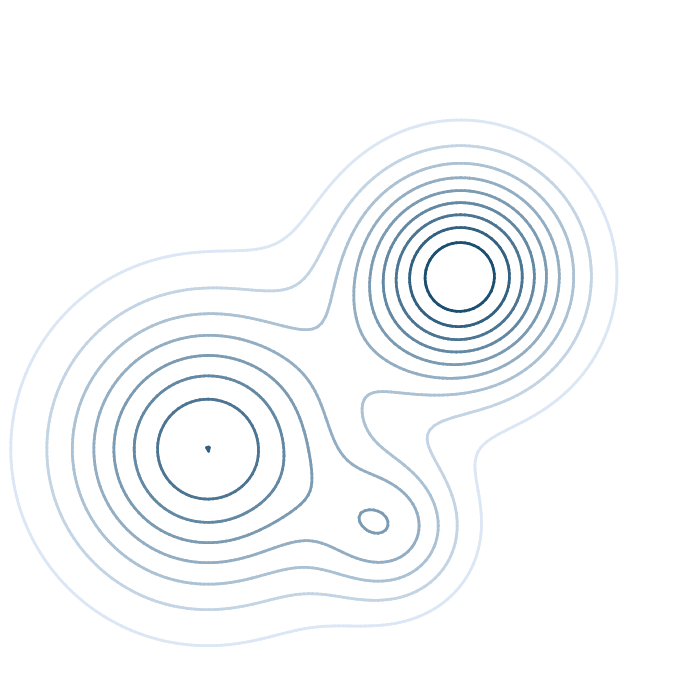
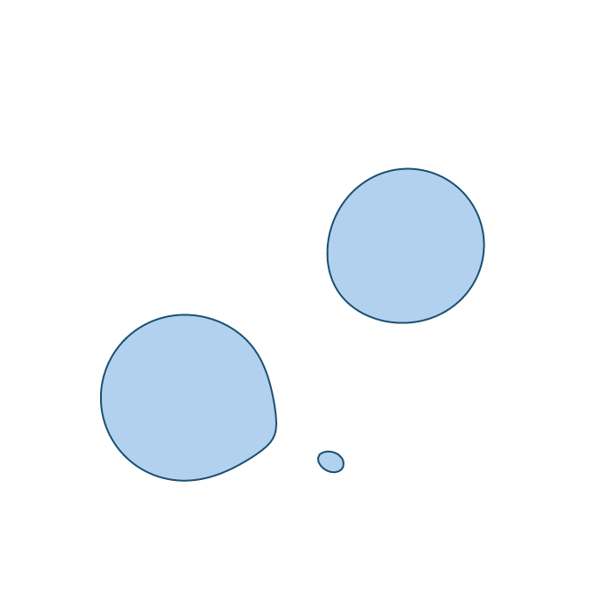
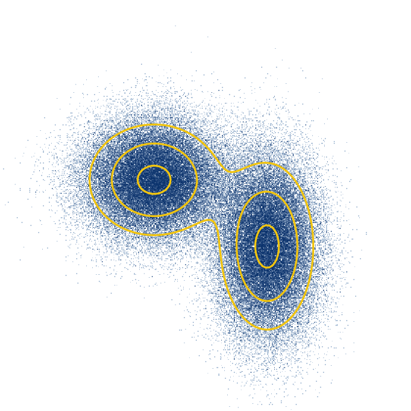
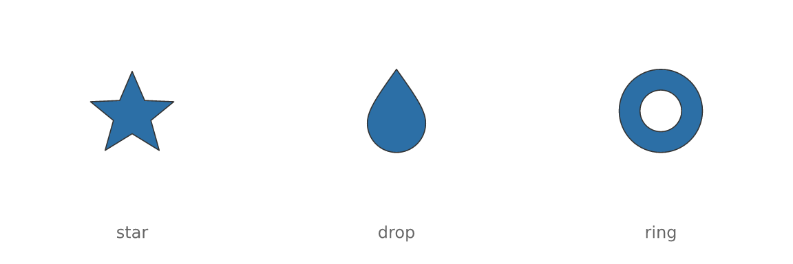

# Geometry operations: booleans, contours, imported paths

Three operations that look unrelated and are not: each **produces
geometry**. A boolean result, a contour line and an imported icon all
come back as ordinary paths, so each can be measured, filled with a
gradient, stroked, hit-tested, simplified, exported as `<path>` data —
and fed into the others.

## Boolean operations

[`vl_path_op()`](https://r-vellum.github.io/vellum/reference/vl_path_op.md)
combines two shapes: `union`, `intersect`, `difference` or `xor`.

``` r

circ <- function(cx, cy, r = 0.3, n = 72) {
  t <- seq(0, 2 * pi, length.out = n + 1)[-(n + 1)]
  list(x = cx + r * cos(t), y = cy + r * sin(t))
}
a <- circ(0.42, 0.5)
b <- circ(0.58, 0.5)

s <- vl_scene(6, 2, dpi = 96, bg = "white")
for (i in seq_along(o <- c("union", "intersect", "difference", "xor"))) {
  s <- s |>
    push(vl_viewport(x = (i - 0.5) / 4, width = 0.25)) |>
    draw(vl_path_op(a, b, o[i], gp = vl_gpar(fill = "#7FB2E5", col = "#1B4F72"))) |>
    draw(polygon_grob(a$x, a$y, gp = vl_gpar(fill = NA, col = "grey75", lty = "dashed"))) |>
    draw(polygon_grob(b$x, b$y, gp = vl_gpar(fill = NA, col = "grey75", lty = "dashed"))) |>
    draw(text_grob(o[i], y = 0.08, gp = vl_gpar(fontsize = 8, col = "grey40"))) |>
    pop()
}
display(s)
```



### Why not just clip?

vellum can already clip one shape by another at render time, and for
simply *showing* an intersection that is often enough.

A boolean result is different in kind. A clip is an instruction to the
renderer; a boolean is a shape. Only the shape can be filled with **its
own** gradient across **its own** bounding box, stroked along the new
boundary the operation created, measured, hit-tested, or used as the
operand of another boolean. Clips also rasterise as masks, and mask
handling degrades on some PDF paths.

Here the centre cell of a three-set diagram is an intersection of
intersections, given a gradient of its own and a stroke along an edge
that exists in neither input:

``` r

c1 <- circ(0.38, 0.58, 0.24)
c2 <- circ(0.62, 0.58, 0.24)
c3 <- circ(0.50, 0.36, 0.24)
centre <- vl_path_op(vl_path_op(c1, c2, "intersect"), c3, "intersect")

venn <- vl_scene(3.6, 3, dpi = 96, bg = "white")
for (cc in list(c1, c2, c3)) {
  venn <- draw(venn, polygon_grob(cc$x, cc$y,
                                  gp = vl_gpar(fill = "#2C6FA655", col = "#1B4F72")))
}
display(draw(venn, S7::set_props(centre, gp = vl_gpar(
  fill = linear_gradient(c("#F1C40F", "#E67E22")), col = "grey20", lwd = 1
))))
```



### Holes

`difference` cuts. The result’s inner rings are wound opposite their
outer one, so a hole is a hole rather than a second solid island:

``` r

plate <- list(x = c(0.1, 0.9, 0.9, 0.1), y = c(0.2, 0.2, 0.8, 0.8))
for (cx in c(0.3, 0.5, 0.7)) plate <- vl_path_op(plate, circ(cx, 0.5, 0.08), "difference")
display(vl_scene(6, 2, dpi = 96, bg = "white") |>
  draw(S7::set_props(plate, gp = vl_gpar(fill = "#34495E", col = NA))))
```


Two things to know. `rule` describes how to read the **inputs** —
whether a ring inside another is a hole (`"evenodd"`) or a separate
island (`"nonzero"`) — and must match how the operands were meant to be
drawn. And operands must be in a single coordinate space; mixing units
is refused rather than silently computed in whichever one came first.

## Contours

[`vl_contour()`](https://r-vellum.github.io/vellum/reference/vl_contour.md)
runs marching squares over any matrix.

``` r

gx <- seq(-3, 3, length.out = 160)
# `outer(xs, ys, f)` puts rows on x and columns on y, which is what
# `vl_contour()` wants -- the same convention as `image()` and `contour()`.
z <- outer(gx, gx, function(x, y) {
  exp(-((x - 1)^2 + (y - 0.6)^2) / 0.8) +
    0.8 * exp(-((x + 1.2)^2 + (y + 0.9)^2) / 1.4) +
    0.4 * exp(-((x - 0.4)^2 + (y + 1.6)^2) / 0.4)
})
levels <- seq(0.1, 0.9, by = 0.1)
cl <- vl_contour(z, levels = levels, xlim = c(-3, 3), ylim = c(-3, 3))
head(cl, 3)
#>   level id         x         y closed
#> 1   0.1  1 -1.452830 -2.587502   TRUE
#> 2   0.1  1 -1.468483 -2.584906   TRUE
#> 3   0.1  1 -1.490566 -2.581434   TRUE
```

``` r

shade <- grDevices::colorRampPalette(c("#DCE7F5", "#1B4F72"))(length(levels))
s <- vl_scene(3.6, 3.6, dpi = 96, bg = "white") |>
  push(vl_viewport(xscale = c(-3, 3), yscale = c(-3, 3)))
for (i in seq_along(levels)) {
  part <- cl[cl$level == levels[i], ]
  s <- draw(s, contour_grob(part, gp = vl_gpar(col = shade[i], lwd = 1.4)))
}
display(pop(s))
```



Segments are **chained** into continuous polylines rather than returned
loose. Under a solid stroke the difference is invisible, and for
everything else it is not: an unchained contour restarts its dash
pattern in every grid cell, and nothing downstream can simplify, measure
or close it.

Closed contours come back marked `closed`, which is what lets them be
filled:

``` r

ring <- cl[cl$level == 0.5 & cl$closed, ]
display(
  vl_scene(3.6, 3.6, dpi = 96, bg = "white") |>
    push(vl_viewport(xscale = c(-3, 3), yscale = c(-3, 3))) |>
    draw(path_grob(vl_unit(ring$x, "native"), vl_unit(ring$y, "native"), id = ring$id,
                   gp = vl_gpar(fill = "#7FB2E599", col = "#1B4F72"))) |>
    pop()
)
```



Note
[`contour_grob()`](https://r-vellum.github.io/vellum/reference/vl_contour.md)
returns **one grob per contour**, and
[`draw()`](https://r-vellum.github.io/vellum/reference/vl_scene.md)
accepts a list of grobs. That is not incidental tidiness:
[`lines_grob()`](https://r-vellum.github.io/vellum/reference/grob.md)
draws a single polyline, and its `id` is the accessibility identifier
rather than a grouping variable as in
[`path_grob()`](https://r-vellum.github.io/vellum/reference/grob.md).
Passing all the contours to one
[`lines_grob()`](https://r-vellum.github.io/vellum/reference/grob.md)
draws a straight line from the end of each to the start of the next —
vellum now refuses a multi-value `id` for exactly that reason.

Cells with a non-finite corner are skipped, so a contour **breaks**
around missing data instead of being drawn through it.

### Over a datashaded base

This is the idiom the aggregate-then-shade design was built for
([`vignette("datashading")`](https://r-vellum.github.io/vellum/articles/datashading.md)):
the grid is a fixed-size intermediate either way, so isolines over a
density surface reuse work already done.

``` r

set.seed(11)
N <- 100000
px <- c(rnorm(N / 2, -1, 0.7), rnorm(N / 2, 1.2, 0.5))
py <- c(rnorm(N / 2, 0.5, 0.6), rnorm(N / 2, -0.8, 0.9))
base <- datashade(px, py, width = 420, height = 420, xlim = c(-4, 4), ylim = c(-4, 4))

dens <- outer(seq(-4, 4, length.out = 120), seq(-4, 4, length.out = 120),
              function(x, y) {
                0.5 * exp(-((x + 1)^2 / (2 * 0.7^2) + (y - 0.5)^2 / (2 * 0.6^2))) +
                  0.5 * exp(-((x - 1.2)^2 / (2 * 0.5^2) + (y + 0.8)^2 / (2 * 0.9^2)))
              })
iso <- vl_contour(dens, levels = c(0.1, 0.25, 0.45), xlim = c(-4, 4), ylim = c(-4, 4))

display(
  vl_scene(3.6, 3.6, dpi = 96, bg = "white") |>
    push(vl_viewport(xscale = c(-4, 4), yscale = c(-4, 4))) |>
    draw(base) |>
    draw(contour_grob(iso, gp = vl_gpar(col = "#F1C40F", lwd = 1.6))) |>
    pop()
)
```



## SVG path data

[`svg_grob()`](https://r-vellum.github.io/vellum/reference/vl_svg_path.md)
parses the `d` attribute of an SVG `<path>` into scene geometry.

`d` is the unit of exchange that matters: icon sets — Font Awesome,
Bootstrap Icons, Lucide, Material — ship one `<path d="...">` per glyph.
That is what makes vector icon markers possible.

``` r

icons <- list(
  star = "M12 2 L15 9 L22 9.3 L16.5 13.8 L18.5 21 L12 17 L5.5 21 L7.5 13.8 L2 9.3 L9 9 Z",
  drop = "M12 2 C7 9 5 12 5 15 a7 7 0 0 0 14 0 c0-3-2-6-7-13 z",
  ring = "M12 2 a10 10 0 1 0 0.001 0 z M12 7 a5 5 0 1 1-0.001 0 z"
)
s <- vl_scene(6, 2, dpi = 96, bg = "white")
for (i in seq_along(icons)) {
  s <- s |>
    draw(svg_grob(icons[[i]], x = (i - 0.5) / length(icons), y = 0.58,
                  size = vl_unit(16, "mm"),
                  gp = vl_gpar(fill = "#2C6FA6", col = "grey20", lwd = 0.8))) |>
    draw(text_grob(names(icons)[i], x = (i - 0.5) / length(icons), y = 0.12,
                   gp = vl_gpar(fontsize = 9, col = "grey40")))
}
display(s)
```



The whole `d` grammar is supported —
`M`/`L`/`H`/`V`/`C`/`S`/`Q`/`T`/`A`/`Z` absolute and relative, implicit
repeated commands, the smooth-curve reflection rules, and elliptical
arcs including the packed flag form (`a1 1 0 011 5 5`) that minified
icon files use. A partial implementation of a spec this small fails on
real files for reasons a user cannot diagnose.

What is *not* here is the rest of SVG: no stylesheets, gradients,
`<use>`, clip paths or element transforms. This reads path data, not
documents. To pull `d` strings out of a file, use an XML parser and pass
each one in:

``` r

doc <- xml2::read_xml("icon.svg")
ds <- xml2::xml_attr(xml2::xml_find_all(doc, "//d1:path"), "d")
lapply(ds, svg_grob, size = vl_unit(10, "mm"))
```

SVG’s y axis points down and vellum’s points up, so
[`svg_grob()`](https://r-vellum.github.io/vellum/reference/vl_svg_path.md)
flips it by default; the geometry is then scaled so its longer side is
`size` and centred on `x`/`y`, which makes icons from sources with
different viewBoxes come out the same size.

### Because it is geometry

Icons take a gradient fill and stay sharp at any size — which
raster-per-point markers cannot do — and they compose with the booleans
above:

``` r

set.seed(5)
k <- 14
mx <- seq(0.06, 0.94, length.out = k)
my <- 0.5 + 0.28 * sin(seq(0, 3 * pi, length.out = k))
s <- vl_scene(6, 2, dpi = 96, bg = "white")
for (i in seq_len(k)) {
  s <- draw(s, svg_grob(icons$star, x = mx[i], y = my[i],
                        size = vl_unit(4 + 5 * (i / k), "mm"),
                        gp = vl_gpar(fill = linear_gradient(c("#F1C40F", "#C0392B")),
                                     col = NA)))
}
display(s)
```


``` r

star <- vl_svg_path(icons$star)
half <- vl_path_op(
  list(x = star$x, y = star$y, nper = nrow(star)),
  list(x = c(0, 24, 24, 0), y = c(0, 0, 11.5, 11.5)),
  "difference", rule = "evenodd"
)
sx <- as.numeric(vctrs::field(half@x, "value"))
sy <- as.numeric(vctrs::field(half@y, "value"))
display(
  vl_scene(2.6, 2.6, dpi = 96, bg = "white") |>
    push(vl_viewport(xscale = c(0, 24), yscale = c(24, 0))) |>
    draw(path_grob(vl_unit(sx, "native"), vl_unit(sy, "native"),
                   id = rep(seq_along(half@nper), half@nper),
                   gp = vl_gpar(fill = "#E67E22", col = "grey20"))) |>
    pop()
)
```


## Where to go next

- [`vignette("placement")`](https://r-vellum.github.io/vellum/articles/placement.md):
  [`vl_hull()`](https://r-vellum.github.io/vellum/reference/vl_hull.md)
  and
  [`vl_buffer()`](https://r-vellum.github.io/vellum/reference/vl_buffer.md),
  the other geometry producers — and the reason
  [`vl_buffer()`](https://r-vellum.github.io/vellum/reference/vl_buffer.md)
  leaves self-intersection alone, which is that repairing it is a
  [`vl_path_op()`](https://r-vellum.github.io/vellum/reference/vl_path_op.md)
  union.
- [`vignette("datashading")`](https://r-vellum.github.io/vellum/articles/datashading.md):
  the aggregate grid the contours pair with.
- [`vignette("scene-and-paint")`](https://r-vellum.github.io/vellum/articles/scene-and-paint.md):
  gradients, patterns and hatching, all of which work on any path these
  produce.
