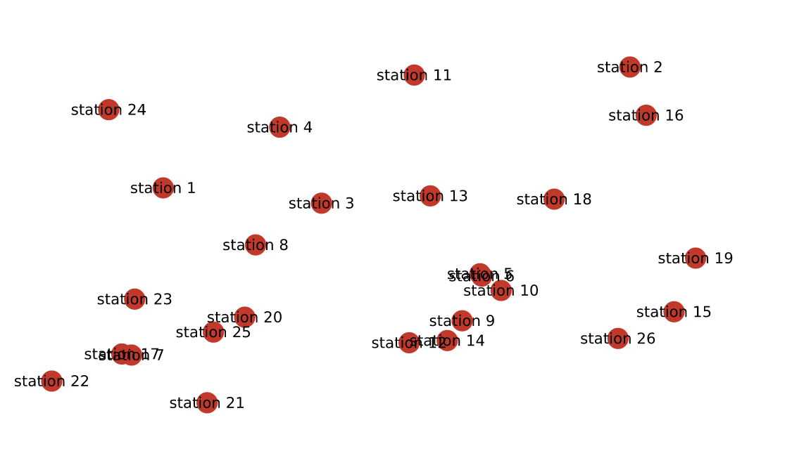
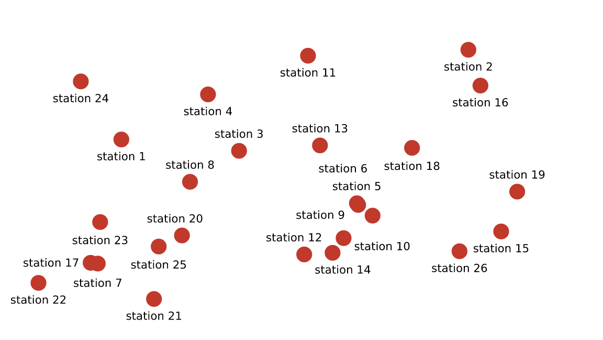
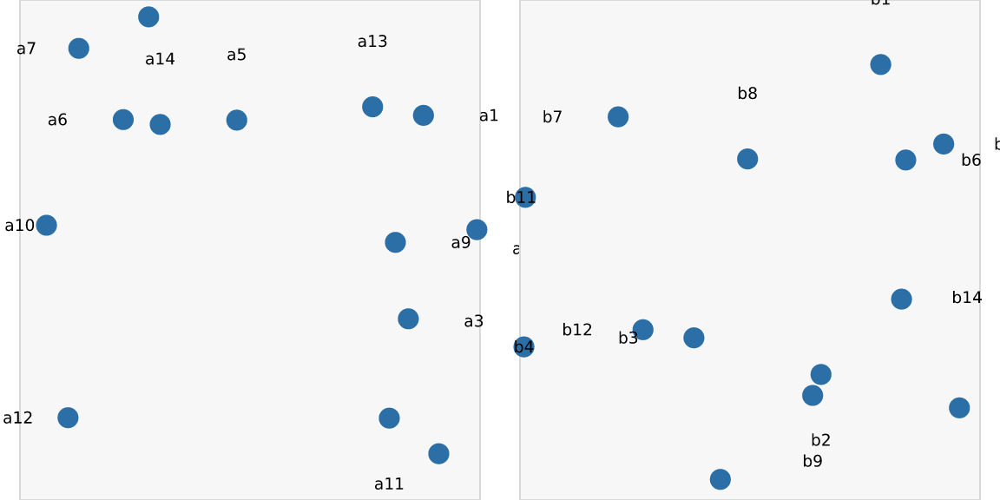
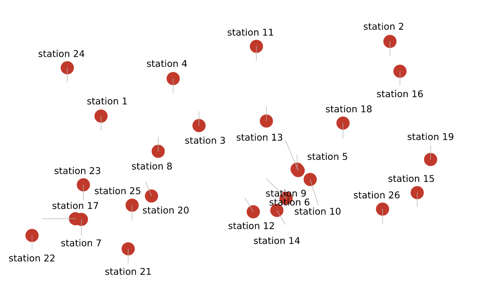
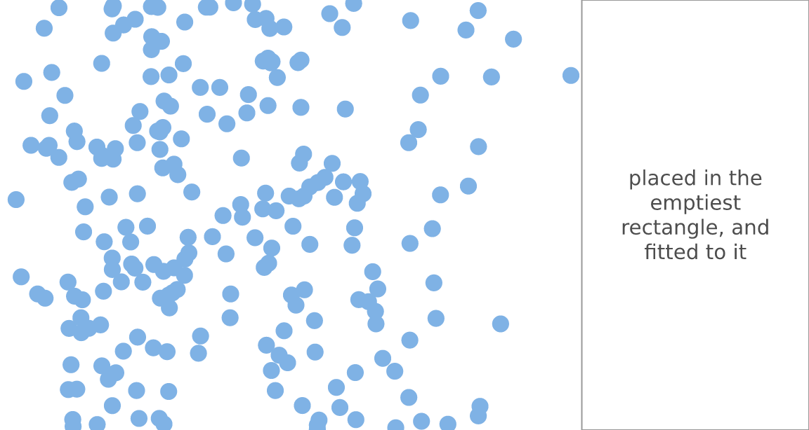
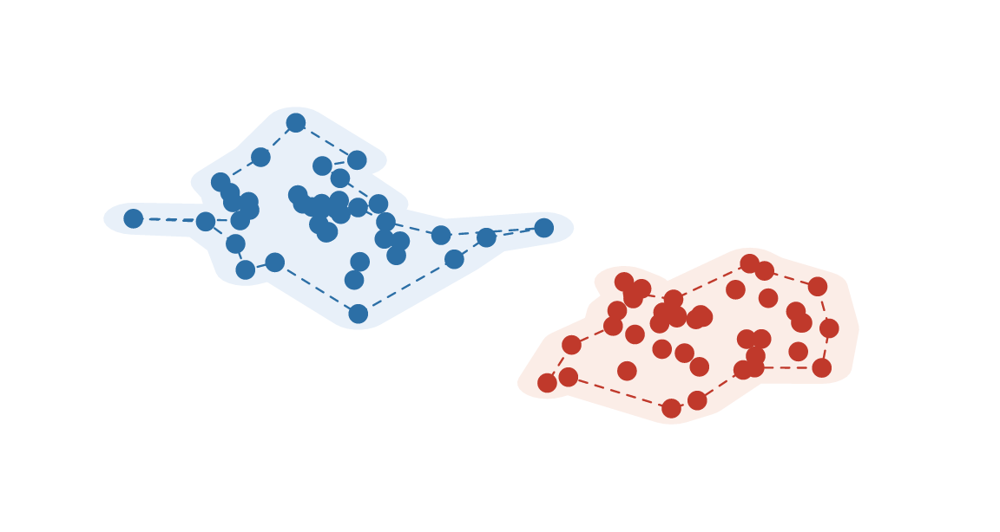
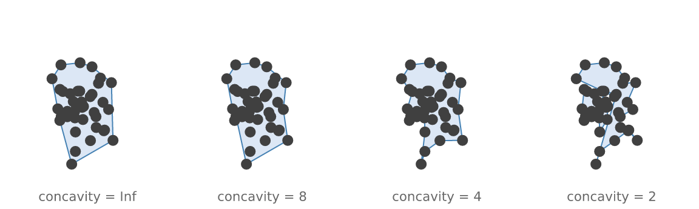

# Placement: repelling labels, finding room, outlining groups

Overlapping labels are the most common defect in a data graphic, and the
hardest to fix from above the engine — because fixing them needs to know
where everything *ended up*, which is information that normally only
exists after drawing.

vellum resolves layout before it draws, so it knows. This article covers
the three things that follow from that: moving labels apart, finding
somewhere to put one thing, and outlining a group.

## Repelling labels

``` r

n <- 26
x <- runif(n) * 0.9 + 0.05
y <- runif(n) * 0.85 + 0.08

scatter <- function() {
  vl_scene(6, 3.4, dpi = 96, bg = "white") |>
    draw(points_grob(x, y, size = vl_unit(2, "mm"),
                     gp = vl_gpar(fill = "#C0392B", col = NA), name = "pts")) |>
    draw(text_grob(paste0("station ", seq_len(n)), x = x, y = y,
                   gp = vl_gpar(fontsize = 8), name = "lab"))
}
display(scatter())
```



``` r

display(vl_repel(scatter(), padding = 0.6))
```



Every label is legible, none has left its point, and nothing was
dropped.

### It does not care what coordinate system you used

This is the part worth understanding, because it is what makes the
feature different from doing the same thing a layer up.

The solve happens in **device pixels**, over boxes that have already
resolved. The answer is then applied as an *absolute millimetre offset*
on top of each label’s existing coordinate — vellum’s compound
`native + mm` unit. So the label keeps its data anchor and moves by
exactly the distance the solver asked for, whatever produced that
anchor.

A label in `native` units inside a panel with a scale of `0..100` on one
axis and `0..0.01` on the other moves by the same mechanism as one in
`npc` on the page. Panels are not solved one at a time; they are all
just boxes.

``` r

two <- vl_scene(6, 3, dpi = 96, bg = "white")
for (i in 1:2) {
  px <- runif(14) * 100
  py <- runif(14) * 0.01
  two <- two |>
    push(vl_viewport(name = paste0("p", i), x = c(0.25, 0.75)[i], width = 0.46,
                     xscale = c(0, 100), yscale = c(0, 0.01))) |>
    draw(rect_grob(gp = vl_gpar(fill = "grey97", col = "grey85"))) |>
    draw(points_grob(vl_unit(px, "native"), vl_unit(py, "native"),
                     size = vl_unit(1.6, "mm"),
                     gp = vl_gpar(fill = "#2C6FA6", col = NA))) |>
    draw(text_grob(paste0(c("a", "b")[i], seq_len(14)),
                   x = vl_unit(px, "native"), y = vl_unit(py, "native"),
                   gp = vl_gpar(fontsize = 7), name = paste0("lab", i))) |>
    pop()
}
display(vl_repel(two, padding = 0.5))
```



### The solve on its own

[`vl_repel()`](https://r-vellum.github.io/vellum/reference/vl_place.md)
is
[`vl_place()`](https://r-vellum.github.io/vellum/reference/vl_place.md)
plus applying the answer.
[`vl_place()`](https://r-vellum.github.io/vellum/reference/vl_place.md)
hands you the answer instead:

``` r

sol <- vl_place(scatter(), padding = 0.6)
head(sol[, c("name", "index", "dx", "dy", "resolved")])
#>   name index          dx        dy resolved
#> 1  lab     1  0.00000000 -4.295429     TRUE
#> 2  lab     2  0.00000000 -4.295429     TRUE
#> 3  lab     3  0.00000000  4.295429     TRUE
#> 4  lab     4  0.00000000 -4.295429     TRUE
#> 5  lab     5 -0.02685361  4.295429     TRUE
#> 6  lab     6 -3.82683432  9.238795     TRUE
```

`dx`/`dy` are millimetres, and `resolved` says whether that label ended
up clear of everything.

Two reasons to want this rather than the finished scene. The first is
leader lines — the shift is a plain offset, so drawing one is
arithmetic:

``` r

moved <- which(abs(sol$dx) + abs(sol$dy) > 1)
with_leaders <- scatter() |>
  draw(segments_grob(
    x0 = vl_unit(x[moved], "npc"), y0 = vl_unit(y[moved], "npc"),
    x1 = vl_unit(x[moved], "npc") + vl_unit(sol$dx[moved], "mm"),
    y1 = vl_unit(y[moved], "npc") + vl_unit(sol$dy[moved], "mm"),
    gp = vl_gpar(col = "grey70", lwd = 0.6)
  ))
display(vl_repel(with_leaders, labels = "lab", padding = 0.6))
```



The second is that `resolved = FALSE` is a decision point. On a
genuinely crowded page some labels cannot be placed, and the useful
responses — drop this one, abbreviate it, shrink the font, show it on
hover — all depend on knowing what the labels *mean*. vellum reports the
failure and stops there rather than guessing; that call belongs to the
layer above.

### How it works, and where it gives up

Relaxation, then repair. Overlaps push labels apart along the axis of
least separation; labels that are clear are eased back toward their
anchor. That alone is a local method, and local methods get stuck — a
label slides out of the collision it is in and never considers that the
far side of its anchor was free the whole time. So a second pass takes
every label still colliding and tries candidate positions on a ring
around its anchor, nearest first, taking the first that is clear. On a
crowded scatter that pass is the difference between most overlaps
remaining and almost none.

`max_shift` bounds how far a label may travel (10 mm by default), so
labels stay near what they label rather than solving the puzzle by
scattering.

## Where is there room?

The other placement question. Not “how do I move these apart” but “where
can this one thing go” — which is what automatic legend and annotation
placement needs.

``` r

cloud <- vl_scene(5, 3.2, dpi = 96, bg = "white") |>
  draw(points_grob(rbeta(220, 2, 5), runif(220), size = vl_unit(1.6, "mm"),
                   gp = vl_gpar(fill = "#7FB2E5", col = NA)))
gap <- vl_empty_region(cloud, grid = 260)
round(gap, 3)
#>    x0    y0    x1    y1 
#> 0.719 0.000 1.000 1.000
```

That composes neatly with width-constrained text
([`vignette("typography")`](https://r-vellum.github.io/vellum/articles/typography.md)):
the region also comes back in millimetres, which is exactly the absolute
measure `text_grob(width=)` wants — so an annotation can be fitted to
the gap that was just found, rather than to a width guessed in advance.

``` r

mm <- vl_empty_region(cloud, grid = 260, unit = "mm")
display(
  cloud |>
    draw(rect_grob(x = mean(gap[c("x0", "x1")]), y = mean(gap[c("y0", "y1")]),
                   width = gap[["x1"]] - gap[["x0"]],
                   height = gap[["y1"]] - gap[["y0"]],
                   gp = vl_gpar(fill = "#FFFFFFCC", col = "grey60"))) |>
    draw(text_grob("placed in the emptiest rectangle, and fitted to it",
                   x = mean(gap[c("x0", "x1")]), y = mean(gap[c("y0", "y1")]),
                   align = "centre", fit = TRUE,
                   width = vl_unit(mm[["x1"]] - mm[["x0"]] - 4, "mm"),
                   height = vl_unit(mm[["y1"]] - mm[["y0"]] - 4, "mm"),
                   gp = vl_gpar(fontsize = 11, col = "grey30")))
)
```



Occupancy is rasterised onto a grid, so the answer is exact *on that
grid*. That is a deliberate approximation — the exact maximal empty
rectangle over n boxes is superquadratic, and nothing is placed to
sub-pixel tolerance. Boxes round outward, so the result is conservative:
it will never claim space that is in fact occupied. Raise `grid` to
trade time for precision.

## Outlining a group

[`vl_hull()`](https://r-vellum.github.io/vellum/reference/vl_hull.md)
and
[`vl_buffer()`](https://r-vellum.github.io/vellum/reference/vl_buffer.md)
are here rather than with the other geometry because exclusion zones are
what label placement wants them for.

``` r

grp <- data.frame(
  x = c(rnorm(40, 0.32, 0.07), rnorm(40, 0.7, 0.06)),
  y = c(rnorm(40, 0.6, 0.09), rnorm(40, 0.38, 0.07)),
  g = rep(1:2, each = 40)
)
s <- vl_scene(5, 3.2, dpi = 96, bg = "white")
for (g in 1:2) {
  p <- grp[grp$g == g, ]
  h <- vl_hull(p$x, p$y, concavity = 4)
  b <- vl_buffer(h$x, h$y, 0.03)
  s <- s |>
    draw(polygon_grob(b$x, b$y,
                      gp = vl_gpar(fill = c("#E8F0F9", "#FBEDE7")[g], col = NA))) |>
    draw(polygon_grob(h$x, h$y,
                      gp = vl_gpar(fill = NA, col = c("#2C6FA6", "#C0392B")[g],
                                   lwd = 1.2, lty = "dashed"))) |>
    draw(points_grob(p$x, p$y, size = vl_unit(1.5, "mm"),
                     gp = vl_gpar(fill = c("#2C6FA6", "#C0392B")[g], col = NA)))
}
display(s)
```



`concavity` runs the opposite way to what the name suggests: **larger is
more convex**. `Inf` (the default) is exactly the convex hull, `8`
follows the points loosely, `4` is a good tight outline, and below about
`3` the boundary starts threading between interior points and crossing
itself.

``` r

p <- data.frame(x = rnorm(40, 0.5, 0.1), y = rnorm(40, 0.5, 0.12))
row <- vl_scene(6, 1.8, dpi = 96, bg = "white")
for (i in seq_along(cs <- c(Inf, 8, 4, 2))) {
  h <- vl_hull(p$x, p$y, concavity = cs[i])
  row <- row |>
    push(vl_viewport(x = (i - 0.5) / 4, width = 0.25)) |>
    draw(polygon_grob(h$x, h$y, gp = vl_gpar(fill = "#DCE7F5", col = "steelblue"))) |>
    draw(points_grob(p$x, p$y, size = vl_unit(1.2, "mm"),
                     gp = vl_gpar(fill = "grey25", col = NA))) |>
    draw(text_grob(paste0("concavity = ", cs[i]), y = 0.06,
                   gp = vl_gpar(fontsize = 8, col = "grey40"))) |>
    pop()
}
display(row)
```



Self-intersection at low `concavity` is inherent to the method, not a
defect: a boundary that threads between interior points has to cross
itself eventually. The same is true of buffering a concave ring —
repairing either is a boolean union, which vellum does not have yet.

## Where to go next

- [`vignette("typography")`](https://r-vellum.github.io/vellum/articles/typography.md):
  the width-constrained text this pairs with.
- [`vignette("inspecting-scenes")`](https://r-vellum.github.io/vellum/articles/inspecting-scenes.md):
  [`vl_lint()`](https://r-vellum.github.io/vellum/reference/vl_lint.md),
  which reports overlap and legibility problems rather than fixing them.
- [`vignette("retained-mode")`](https://r-vellum.github.io/vellum/articles/retained-mode.md):
  [`edit_node()`](https://r-vellum.github.io/vellum/reference/node_names.md),
  the mechanism
  [`vl_repel()`](https://r-vellum.github.io/vellum/reference/vl_place.md)
  uses to return a modified scene.
