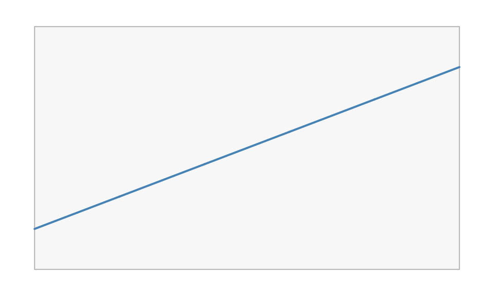
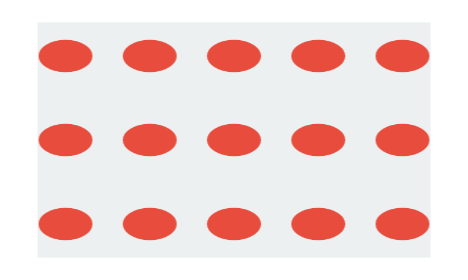
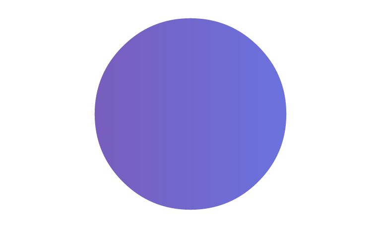
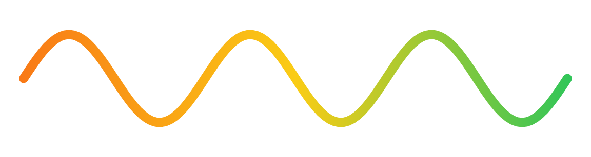
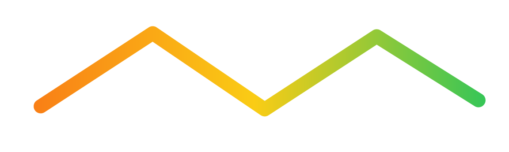

# The scene graph and the paint model

This article covers the two pieces you spend most of your time with in
vellum: the **scene graph** (units, viewports, and the tree they form)
and the **paint model** (gradients, patterns, and masks) shared across
every backend.

## The scene graph

A vellum scene is a tree. The root is the page created by
[`vl_scene()`](https://r-vellum.github.io/vellum/reference/vl_scene.md);
every
[`push()`](https://r-vellum.github.io/vellum/reference/vl_scene.md) adds
a
[`vl_viewport()`](https://r-vellum.github.io/vellum/reference/vl_viewport.md)
child and descends into it; every
[`draw()`](https://r-vellum.github.io/vellum/reference/vl_scene.md)
appends a grob at the current level;
[`pop()`](https://r-vellum.github.io/vellum/reference/vl_scene.md)
climbs back up. The tree is an immutable value that outlives its
construction, which is what enables the queries in
[`vignette("retained-mode")`](https://r-vellum.github.io/vellum/articles/retained-mode.md).

Because it is a tree, viewports nest, and a child’s geometry is
expressed relative to its parent. That is the whole mechanism behind
panels, insets, and faceting: push a viewport for a sub-region, draw
inside it in local coordinates, then pop.

``` r

vl_scene(6, 2.4, bg = "white") |>
  # a full-width band
  draw(rect_grob(height = 0.6, gp = vl_gpar(fill = "#eef2f6", col = NA))) |>
  # an inset viewport occupying the middle third
  push(vl_viewport(x = 0.5, width = 1 / 3, height = 0.8)) |>
  draw(rect_grob(gp = vl_gpar(fill = "#3a7bd5", col = NA))) |>
  draw(text_grob("inset", gp = vl_gpar(col = "white", fontface = "bold"))) |>
  pop()
```


## Units

Coordinates and sizes are
[`vl_unit()`](https://r-vellum.github.io/vellum/reference/vl_unit.md)
vectors: a value paired with a unit name. Each element carries its own
unit, so one vector can mix coordinate systems, and a grob can even use
different units on its x and y axes.

The units you reach for most:

- `"npc"` (the default): normalised parent coordinates, `0` at
  bottom/left and `1` at top/right of the current viewport.
- `"native"`: the enclosing viewport’s `xscale` / `yscale`, so data
  values map directly. This is what you use for plotted data.
- `"mm"`, `"cm"`, `"in"`, `"pt"`: absolute physical lengths that keep
  their size regardless of the viewport.

A bare number is interpreted in the grob’s default units (usually
`"npc"`), so `x = 0.5` and `x = vl_unit(0.5, "npc")` are the same thing.

``` r

vl_unit(1:3, "native")
#> <vellum_unit[3]>
#> [1] 1native 2native 3native
vl_unit(c(0.5, 1), c("npc", "in"))
#> <vellum_unit[2]>
#> [1] 0.5npc 1.0in
```

`"native"` units need a viewport with scales to resolve against. Set
`xscale` and `yscale` when you push:

``` r

vl_scene(5, 3, bg = "white") |>
  push(vl_viewport(
    width = 0.86, height = 0.82,
    xscale = c(0, 10), yscale = c(-5, 25)
  )) |>
  draw(rect_grob(gp = vl_gpar(fill = "grey97", col = "grey70"))) |>
  draw(lines_grob(
    x = vl_unit(0:10, "native"),
    y = vl_unit((0:10) * 2, "native"),
    gp = vl_gpar(col = "steelblue", lwd = 2)
  )) |>
  pop()
```



Font- and string-relative units (`"char"`, `"line"`, `"strwidth"`,
`"grobwidth"`) resolve to millimetres at construction, because vellum
can measure text without a device. Arithmetic reduces as far as it can:
same-unit sums combine, two absolute units become millimetres, and a
position base plus an absolute becomes a *compound* unit that keeps the
base and carries the offset in mm
(`vl_unit(1, "npc") - vl_unit(2, "mm")` prints as `1npc-2mm` and
resolves as “the npc position, then 2 mm left”, exactly, at any size or
dpi). Only two *different* position bases (`"npc"` plus `"native"`)
cannot be reduced to one unit, and that errors rather than being
guessed.

## The paint model

Any `fill` in
[`vl_gpar()`](https://r-vellum.github.io/vellum/reference/vl_gpar.md)
can be more than a flat colour — and so can `col`. The same three paint
types work identically on the raster, SVG, and PDF backends (with the
documented exception that the PDF backend does not yet rasterise
patterns).

### Gradients

[`linear_gradient()`](https://r-vellum.github.io/vellum/reference/gradients.md)
and
[`radial_gradient()`](https://r-vellum.github.io/vellum/reference/gradients.md)
interpolate between colour stops. Their geometry is given in a
coordinate system (`"npc"` by default) and is resolved against the
viewport at draw time, so a gradient transforms with its grob just like
the outline does.

``` r

vl_scene(6, 2.2, bg = "white") |>
  push(vl_viewport(x = 0.28, width = 0.44)) |>
  draw(rect_grob(
    width = 0.8, height = 0.7,
    gp = vl_gpar(fill = linear_gradient(c("#1b2a4a", "#3a7bd5")), col = NA)
  )) |>
  pop() |>
  push(vl_viewport(x = 0.72, width = 0.44)) |>
  draw(circle_grob(
    r = 0.34,
    gp = vl_gpar(fill = radial_gradient(c("#f6d365", "#fda085")), col = NA)
  )) |>
  pop()
```


Stops blend in sRGB by default. Blending two distant hues there passes
through a muddy, over-dark middle — a blue→yellow ramp dips through
grey. Set `interpolation = "oklab"` to blend in the perceptually-uniform
Oklab space instead, so the ramp stays even and vivid. The same option
works on every backend (the stops are pre-sampled in Oklab into ordinary
sRGB stops), and the default `"srgb"` is unchanged.

``` r

bar <- function(x, interp) {
  rect_grob(
    x = x, width = 0.46, height = 0.7,
    gp = vl_gpar(col = NA, fill = linear_gradient(c("blue", "yellow"), interpolation = interp))
  )
}
vl_scene(6, 1.6, bg = "white") |>
  draw(bar(0.27, "srgb")) |> # sRGB: grey dead-zone in the middle
  draw(bar(0.73, "oklab")) # Oklab: clean cyan/green transition
```


### Patterns

[`vl_pattern()`](https://r-vellum.github.io/vellum/reference/vl_pattern.md)
fills a shape by tiling a grob (or a list of grobs). The tile is
authored in the unit square and repeated across a cell whose size you
choose.

``` r

tile <- list(
  rect_grob(gp = vl_gpar(fill = "#ecf0f1", col = NA)),
  circle_grob(r = 0.32, gp = vl_gpar(fill = "#e74c3c", col = NA))
)

vl_scene(4, 2.4, bg = "white") |>
  draw(rect_grob(
    width = 0.84, height = 0.84,
    gp = vl_gpar(fill = vl_pattern(tile, width = 0.18, height = 0.3), col = NA)
  ))
```



### Hatching

[`vl_hatch()`](https://r-vellum.github.io/vellum/reference/vl_hatch.md)
fills a shape with ruled lines. Unlike
[`vl_pattern()`](https://r-vellum.github.io/vellum/reference/vl_pattern.md),
which rasterises a tile, a hatch is **geometry** — it stays crisp at any
zoom, prints correctly, and is real `<path>` data in SVG rather than an
embedded image.

``` r

pal <- c("#D62728", "#2CA02C", "#1F77B4", "#FF7F0E")
angles <- c(0, 45, 90, 135)
s <- vl_scene(6, 1.8)
for (i in 1:4) {
  s <- draw(s, rect_grob(
    x = (i - 0.5) / 4, width = 0.2, height = 0.7,
    gp = vl_gpar(fill = vl_hatch(angle = angles[i], spacing = 3.2, col = pal[i],
                                 bg = "white"),
                 col = "grey25", lwd = 0.8)
  ))
}
display(s)
```


`spacing` and `width` are in points, so a hatch keeps its proportions at
any dpi — the same convention `fontsize` and the text halo use.

**The reason to reach for it** is that a hatch survives being seen
without colour. A categorical encoding that fails for a red/green-blind
reader — which `render(cvd = )` will show you and
[`vl_lint()`](https://r-vellum.github.io/vellum/reference/vl_lint.md)
will flag — is fixed by encoding with texture *as well as* hue. Distinct
angles (0, 45, 90, 135) read as distinct categories whatever happens to
the colours. See
[`vignette("render-quality")`](https://r-vellum.github.io/vellum/articles/render-quality.md)
for the simulation, and
[`vignette("inspecting-scenes")`](https://r-vellum.github.io/vellum/articles/inspecting-scenes.md)
for the linter.

Hatching is expanded in the scene walk into stroked spans, computed by
scanline crossing against the shape, so no backend needs a hatch
primitive of its own and only the spans actually inside the shape are
emitted. The trade is that SVG gets one path of spans rather than a
`<pattern>` reference.

### Masks and group opacity

A mask is a grob whose coverage modulates the visibility of a viewport’s
contents. Wrap it with
[`as_mask()`](https://r-vellum.github.io/vellum/reference/as_mask.md)
and pass it to `vl_viewport(mask = ...)`. Here a linear gradient is
clipped to a circular alpha mask.

``` r

vl_scene(4, 2.4, bg = "white") |>
  push(vl_viewport(
    mask = as_mask(circle_grob(r = 0.42, gp = vl_gpar(fill = "white", col = NA)))
  )) |>
  draw(rect_grob(gp = vl_gpar(fill = linear_gradient(c("#7f53ac", "#647dee")), col = NA))) |>
  pop()
```



Related to masks is **group opacity**. Setting
`vl_viewport(alpha = ...)` composites the viewport’s contents as a
single isolated layer at that opacity, so overlapping elements do not
accumulate the way per-element `vl_gpar(alpha = )` would. That
distinction (compositing a group versus fading each mark) is exactly the
kind of control a grammar layer needs from its backend.

### Stroking with a gradient

`col` takes the same paints `fill` does. The difference is only *where*
they apply: a fill paints the region a shape encloses, a stroke paints
the region the line covers. So a trajectory can carry its colour along
itself:

``` r

t <- seq(0, 1, length.out = 120)
display(
  vl_scene(6, 1.6) |>
    draw(lines_grob(0.04 + 0.92 * t, 0.5 + 0.28 * sin(6 * pi * t),
                    gp = vl_gpar(col = linear_gradient(c("#F97316", "#FACC15", "#22C55E")),
                                 lwd = 9)))
)
```



That is real paint on every backend — SVG emits `stroke="url(#…)"`, PDF
a proper shading — not a rasterised approximation, and not the usual
workaround of emitting hundreds of one-segment lines each in a slightly
different flat colour. It applies to any stroked path, outlines
included.

One consequence: text and markers take the gradient’s **first stop**
rather than the ramp, because a glyph run has no path to run a ramp
along. They fall back to a colour rather than silently not drawing.

### Dash phase

`dash_phase` says how far into the dash pattern a line begins, in
multiples of `lwd` — so it scales with the line width exactly as the
dash nibbles do. Stepping it across a set of rules makes the dashes
walk, which is also how you animate marching ants.

``` r

s <- vl_scene(6, 1.4)
for (i in 0:3) {
  s <- draw(s, segments_grob(0.04, 0.85 - i * 0.22, 0.96, 0.85 - i * 0.22,
    gp = vl_gpar(col = "grey15", lwd = 5, lty = "dashed", dash_phase = i * 1.5)))
}
display(s)
```


## Filling a line

Everything above fills an *area*. A line has no area: a stroke is a
colour applied along a path, not a region, so `fill` on a
[`lines_grob()`](https://r-vellum.github.io/vellum/reference/grob.md)
has nothing to act on.
[`stroke_to_path()`](https://r-vellum.github.io/vellum/reference/stroke_to_path.md)
converts one into the other — it returns the region the stroke would
have inked, as a
[`path_grob()`](https://r-vellum.github.io/vellum/reference/grob.md) you
can fill like any other:

``` r

zig <- lines_grob(c(0.08, 0.3, 0.52, 0.74, 0.94),
                  c(0.30, 0.78, 0.28, 0.76, 0.34),
                  gp = vl_gpar(col = "steelblue", lwd = 16))

ribbon <- stroke_to_path(zig, width = 6, height = 1.8)

display(
  vl_scene(6, 1.8) |>
    draw(S7::set_props(ribbon, gp = vl_gpar(
      fill = linear_gradient(c("#F97316", "#FACC15", "#22C55E")), col = NA
    )))
)
```



The expansion uses the same stroker the rasterizer uses, so the outline
is exactly the region that would have been inked rather than an
approximation of it. The same conversion is what you want for a cutting
plotter or a CNC tool, which need a closed shape rather than a
centreline.

One consequence is worth being explicit about: **the result is baked at
one size.** A stroke width is a device quantity, so its outline only
exists once a page size and resolution are chosen — they are arguments
to
[`stroke_to_path()`](https://r-vellum.github.io/vellum/reference/stroke_to_path.md),
and the returned coordinates are absolute millimetres. The outline will
not rescale with the page the way the original stroke would. That is
inherent: an outline is a shape, not a stroke.

## A note on dense paths

Paths with thousands of vertices — a coastline, a long time series —
carry far more detail than the canvas has pixels to distinguish. vellum
simplifies them at **render resolution**, dropping vertices that could
not have changed a pixel. The renderer is the only layer that knows the
resolution, which is why this belongs here rather than in a
data-preparation step.

It is automatic and needs no code, but the dial is
`options(vellum.simplify = )`: a Douglas–Peucker tolerance in device
pixels, defaulting to `0.1`, with `0` disabling it. On a 50,000-vertex
coastline it is worth roughly 1.7× on render time and 65% of the SVG
size.

Like the marker-sprite and glyph-bitmap fast paths, this is a deliberate
fidelity trade rather than a free lunch, so it engages only where the
win is real: paths under 1000 points are never touched, and stay
byte-identical.

## Recap

- A scene is a retained tree of nested viewports and grobs, built with
  [`push()`](https://r-vellum.github.io/vellum/reference/vl_scene.md) /
  [`draw()`](https://r-vellum.github.io/vellum/reference/vl_scene.md) /
  [`pop()`](https://r-vellum.github.io/vellum/reference/vl_scene.md).
- [`vl_unit()`](https://r-vellum.github.io/vellum/reference/vl_unit.md)
  vectors express geometry; `"npc"` is relative to the viewport,
  `"native"` follows the data scales, and `"mm"` and friends are
  absolute.
- `vl_gpar(fill = )` **and `vl_gpar(col = )`** accept gradients,
  patterns and hatches, and
  [`vl_viewport()`](https://r-vellum.github.io/vellum/reference/vl_viewport.md)
  accepts masks, group opacity, and blend modes, all consistent across
  backends.
- [`stroke_to_path()`](https://r-vellum.github.io/vellum/reference/stroke_to_path.md)
  turns a stroke into a fillable region, so a line can carry a gradient;
  dense paths are simplified at render resolution automatically.

Next, see
[`vignette("retained-mode")`](https://r-vellum.github.io/vellum/articles/retained-mode.md)
for what a finished scene can tell you about itself. \`\`\`
