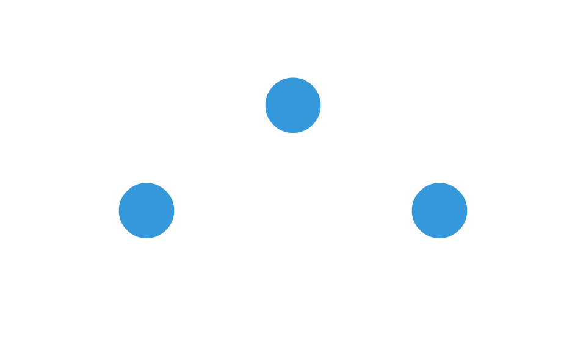

# The scene contract: what vellumplot and vellumwidget depend on

vellum is the backend for a small ecosystem:
[vellumplot](https://r-vellum.github.io/vellumplot/) compiles a grammar
of graphics *into* a vellum scene, and
[vellumwidget](https://r-vellum.github.io/vellumwidget/) turns a
rendered scene into an interactive HTML widget. Both bind to a narrow
seam:
[`scene_model()`](https://r-vellum.github.io/vellum/reference/scene_model.md),
[`scene_svg()`](https://r-vellum.github.io/vellum/reference/scene_svg.md),
and the per-element metadata that rides on grobs. Because the three
packages are version-locked and co-released, a change to that seam can
break the layers above it silently.

**This article is the authoritative description of that seam.** If you
are building on vellum, or changing vellum’s output, this is the
contract to hold to. (It supersedes the internal design note
`_docs/DESIGN-INTERACTIVITY.md`, which is kept only as history.)

## The seam, in one picture

      vellumplot  ──compiles a plot to grobs carrying──▶  key / meta / id / role
                                                            │
      vellum  ──renders──▶  scene_svg()   (data-key, data-vellum-*, role attrs)
                            scene_model()  (per-element table: identity + bbox)
                                                            │
      vellumwidget  ──reads scene_svg() + scene_model()──▶  hover / select / brush / link

Everything below the grammar is *pure metadata*: a static PNG/SVG render
never calls
[`scene_model()`](https://r-vellum.github.io/vellum/reference/scene_model.md),
and a grob without a `key`/`meta` still draws exactly as before. Nothing
here changes what is painted.

## Carrying identity on a grob

The batched mark constructors
([`points_grob()`](https://r-vellum.github.io/vellum/reference/grob.md),
[`circle_grob()`](https://r-vellum.github.io/vellum/reference/grob.md),
[`rect_grob()`](https://r-vellum.github.io/vellum/reference/grob.md),
[`segments_grob()`](https://r-vellum.github.io/vellum/reference/grob.md),
[`hexagon_grob()`](https://r-vellum.github.io/vellum/reference/grob.md),
[`sector_grob()`](https://r-vellum.github.io/vellum/reference/grob.md))
take two optional per-element arguments:

- `key`: a character vector of **data keys**, one per element
  (recycled). This is the join key a host uses to tie an on-screen
  element back to a datum.
- `meta`: a list of **free-form per-element records** (recycled), e.g. a
  tooltip string or field values.

Every grob also takes `id` and `role` (a single value per grob) for
semantic identity and accessibility.

``` r

s <- vl_scene(5, 3, bg = "white") |>
  draw(points_grob(
    x    = c(0.25, 0.5, 0.75),
    y    = c(0.4, 0.7, 0.4),
    size = vl_unit(6, "mm"),
    gp   = vl_gpar(fill = "#3498db", col = NA),
    key  = c("a", "b", "c"),
    meta = list(
      list(tooltip = "first"),
      list(tooltip = "second"),
      list(tooltip = "third")
    )
  ))
s
```



(Each batched grob carries one graphical style; the grammar layer above
vellum emits one grob per style bucket, so a scatter with three colours
is three
[`points_grob()`](https://r-vellum.github.io/vellum/reference/grob.md)s.
The `key`/`meta` machinery is per element regardless.)

## `scene_model()`: the per-element table

[`scene_model()`](https://r-vellum.github.io/vellum/reference/scene_model.md)
walks the rendered scene and returns a list of **two data frames**.

``` r

m <- scene_model(s)
names(m)
#> [1] "elements" "panels"
```

### `elements`

One row per drawn element of the *keyable* marks, **in paint order**:

``` r

str(m$elements)
#> 'data.frame':    3 obs. of  14 variables:
#>  $ key  : chr  "a" "b" "c"
#>  $ mark : chr  "point" "point" "point"
#>  $ id   : chr  NA NA NA
#>  $ name : chr  NA NA NA
#>  $ panel: chr  NA NA NA
#>  $ x0   : num  97.3 217.3 337.3
#>  $ y0   : num  150.1 63.7 150.1
#>  $ x1   : num  143 263 383
#>  $ y1   : num  195 109 195
#>  $ x    : num  120 240 360
#>  $ y    : num  172.8 86.4 172.8
#>  $ w    : num  45.4 45.4 45.4
#>  $ h    : num  45.4 45.4 45.4
#>  $ meta :List of 3
#>   ..$ :List of 1
#>   .. ..$ tooltip: chr "first"
#>   ..$ :List of 1
#>   .. ..$ tooltip: chr "second"
#>   ..$ :List of 1
#>   .. ..$ tooltip: chr "third"
```

The columns are the contract:

| column | type | meaning |
|----|----|----|
| `key` | character | the data key (`NA` if the element was drawn without one) |
| `mark` | character | the mark kind (see vocabulary below) |
| `id` | character | the grob `id` (`NA` if unset) |
| `name` | character | the grob `name` (`NA` if unset) |
| `panel` | character | the enclosing named panel (`NA` if none) |
| `x0, y0, x1, y1` | numeric | device-pixel bounding box |
| `x, y` | numeric | element centre, `(x0+x1)/2, (y0+y1)/2` |
| `w, h` | numeric | element size, `x1-x0, y1-y0` |
| `meta` | list | the free-form per-element record (list-column) |

The `mark` vocabulary is a closed set: `rect`, `point`, `circle`,
`hexagon`, `sector`, `segment`, `path`, `line`, `polygon`.

Two families produce these rows:

- **Batched marks** (`rect`, `point`, `circle`, `hexagon`, `sector`,
  `segment`) emit **one row per element, always**, even when unkeyed
  (then `key` is `NA`).
- **Single-shape marks** (`path`, `line`, `polygon`) emit **one row per
  grob, and only when keyed**. An unkeyed path/line/polygon is
  geometry-only and does not appear in the table. (A single `sf`
  feature, one polygon or linestring, is exactly one such element.)
  These constructors do not take a `key` argument; the grammar keys them
  by setting the grob’s `keys` slot, which is how a single sf feature
  becomes addressable.

### `panels`

One row per **named panel** (a named viewport becomes an addressable
panel), with the bounding box of that panel’s elements:

``` r

str(m$panels)
#> 'data.frame':    0 obs. of  5 variables:
#>  $ name: chr 
#>  $ x0  : num 
#>  $ y0  : num 
#>  $ x1  : num 
#>  $ y1  : num
```

Columns: `name`, `x0`, `y0`, `x1`, `y1`.

### The `meta` key vocabulary

vellum treats `meta` as opaque: it is a free-form list, recycled to the
element count and carried through untouched; vellum does **not** name or
validate its keys. The following key names are **conventions** the
grammar (vellumplot) writes and the widget (vellumwidget) reads.
Documenting them here keeps the three layers in step; they are not
enforced by vellum.

| `meta` key | written by | read by | purpose |
|----|----|----|----|
| `tooltip` | vellumplot `tooltip=` | vellumwidget | hover tooltip text (falls back to `key`) |
| `data_id` | vellumplot `data_id=` | (becomes the `key`) | the data key for an element |
| `hover_group` | vellumplot `hover_group=` | vellumwidget | co-highlight a group on hover |
| `hover_color` | vellumplot mark aesthetic | vellumwidget | per-element hover outline colour |
| `selected_color` | vellumplot mark aesthetic | vellumwidget | per-element selection colour |
| `legend` | vellumplot legend keying | vellumwidget | the series a mark belongs to |
| `legend_for` | vellumplot legend keying | vellumwidget | the series a legend swatch drives (`"<aes>:<level>"`) |

If you add a convention, add it here.

## `scene_svg()`: the emitted attributes

[`scene_svg()`](https://r-vellum.github.io/vellum/reference/scene_svg.md)
returns the same scene as an SVG string. Interactivity rides on SVG
attributes; the raster and PDF backends ignore all of them.

``` r

svg <- scene_svg(s)
# the data-key attributes on the three points:
regmatches(svg, gregexpr('data-key="[^"]*"', svg))[[1]]
#> [1] "data-key=\"a\"" "data-key=\"b\"" "data-key=\"c\""
```

Four attribute mechanisms, each emitted only when its source is set:

| attribute           | source         | scope          | set from                 |
|---------------------|----------------|----------------|--------------------------|
| `data-key`          | grob `key`     | per element    | `points_grob(key=)` etc. |
| `data-vellum-id`    | grob `id`      | per grob/node  | `*_grob(id=)`            |
| `data-vellum-name`  | grob `name`    | per grob/node  | `*_grob(name=)`          |
| `role`              | grob `role`    | per grob/node  | `*_grob(role=)`          |
| `data-vellum-panel` | named viewport | wrapping `<g>` | `vl_viewport(name=)`     |

An empty/`NULL` source emits **no attribute**, so a scene that declares
no interactivity is byte-for-byte identical to one built before any of
this existed.

## Accessibility

A scene carries an optional accessible **name** and **description**, set
with `vl_scene(title=, desc=)` or `describe(scene, title=, desc=)`. When
present:

- the **SVG** root becomes `<svg role="img" aria-labelledby="…">` with
  `<title>` and `<desc>` children (the reliable screen-reader pattern;
  WCAG 1.1.1);
- the **PDF** is a **tagged PDF**: the chart is a `Figure` in the
  structure tree whose `Alt` is the description.

This is additive: with no title/desc the output is unchanged. The
grammar layer (`vellumplot`) sets these automatically from the plot’s
title and an auto-generated (or `labs(alt=)`) alt text. See vellumplot’s
[Accessibility
article](https://r-vellum.github.io/vellumplot/articles/accessibility.html).
Per-element `role` (above) is a genuine ARIA role; the interactive
widget layer (`vellumwidget`) adds keyboard navigation and live-region
announcements on top.

## Invariants the contract guarantees

These are the properties vellumplot and vellumwidget are entitled to
rely on, and that vellum’s own tests (`tests/testthat/test-contract.R`)
pin down:

1.  **Paint order.** `scene_model()$elements` is in draw order, and the
    SVG emits elements in the same order. A host can zip the SVG DOM and
    the table positionally.
2.  **Semantic/geometry agreement.**
    [`scene_model()`](https://r-vellum.github.io/vellum/reference/scene_model.md)
    builds the identity columns from the R grob tree and the geometry
    columns from the compiled backend, then asserts they enumerate the
    same elements: the element counts must match and the `key` column
    must be identical at every position. A mismatch is a hard error (a
    compiler bug), never a silent mis-join.
3.  **Additivity.** `key`/`meta`/`id`/`role` never change what is drawn.
    A render with no keys is identical to the same scene without the
    machinery, on every backend.
4.  **Stable `id` join key.** A grob’s `id` surfaces as `data-vellum-id`
    in the SVG *and* is the join key vellumplot records in its
    provenance table, so a widget can map an SVG node to the grammar
    record that produced it.

## For contributors

If you change any of the following, update this article and the contract
tests in the same commit, and expect to co-release vellumplot and
vellumwidget:

- the `elements`/`panels` column set or types,
- the `mark` vocabulary,
- which marks are keyable, or the batched-vs-single-shape rule,
- the SVG attribute names, or when they are emitted,
- the reserved `meta` key vocabulary. \`\`\`
