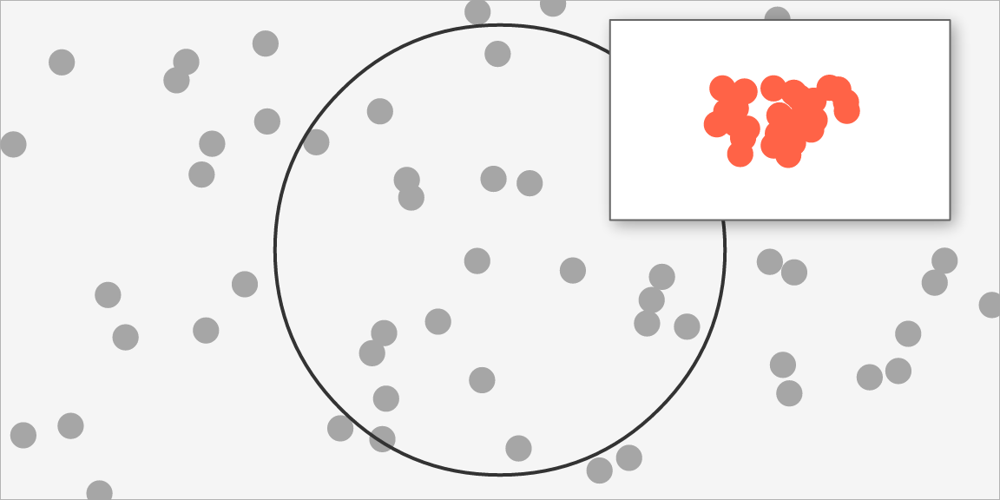

# Scenes as values: saving, comparing, composing

A vellum scene is an immutable value describing what to draw. This
article is about treating it as one: writing it to a file,
fingerprinting it, comparing two of them, and nesting one inside
another.

None of this needs a device, because none of it needs pixels.

``` r

plot_of <- function(fill = "steelblue", r = 0.3) {
  set.seed(1)
  vl_scene(4, 3, dpi = 96, bg = "white") |>
    push(vl_viewport(name = "panel", xscale = c(0, 1), yscale = c(0, 1))) |>
    draw(rect_grob(gp = vl_gpar(fill = "grey96", col = "grey70"))) |>
    draw(points_grob(runif(60), runif(60), gp = vl_gpar(fill = fill, col = NA))) |>
    draw(circle_grob(r = r, name = "marker",
                     gp = vl_gpar(fill = NA, col = "grey20", lwd = 2))) |>
    pop()
}
```

## Saving a scene

[`scene_write()`](https://r-vellum.github.io/vellum/reference/scene_write.md)
and
[`scene_read()`](https://r-vellum.github.io/vellum/reference/scene_write.md)
persist a built scene and rebuild it. `.rds` needs nothing; `.json` is a
portable text format and needs jsonlite.

``` r

f <- tempfile(fileext = ".rds")
scene_write(plot_of(), f)
identical(as_scene_spec(scene_read(f)), as_scene_spec(plot_of()))
#> [1] TRUE
```

What this is for: caching a built scene without re-running the code that
built it, sending one to a worker process to render, and keeping a
reproducible intermediate between the code and the pixels.

Underneath is
[`as_scene_spec()`](https://r-vellum.github.io/vellum/reference/as_scene_spec.md),
which turns the scene into a plain nested list of R vectors, and
[`from_scene_spec()`](https://r-vellum.github.io/vellum/reference/as_scene_spec.md),
which rebuilds it. The conversion is generic over the S7 property model
rather than written per grob type, so a grob added to vellum later
serializes with no change to the serializer.

This sits one level below `vellumplot`’s *plot* spec, and the two
compose rather than compete. A plot spec is portable and re-renderable
at any size; a scene spec is the resolved artifact — the grobs, units
and viewports as they will actually be drawn. Keep the plot spec to
re-render, keep the scene spec to reproduce exactly this scene.

One deliberate omission: the build-time `nid` token is not serialized.
It is a monotonic counter used by the render cache, and keeping it would
make two identical scenes built separately serialize — and therefore
hash and diff — differently, which is the opposite of what a fingerprint
is for.

## Fingerprinting

``` r

c(
  same_content = scene_hash(plot_of()) == scene_hash(plot_of()),
  changed_fill = scene_hash(plot_of()) == scene_hash(plot_of(fill = "tomato"))
)
#> same_content changed_fill 
#>         TRUE        FALSE
```

Two independently-built scenes with the same content hash the same; any
change to what is drawn changes the hash. That makes it usable as a
cache key, and as a test assertion that a refactor did not alter a
figure.

## Comparing

[`scene_hash()`](https://r-vellum.github.io/vellum/reference/scene_hash.md)
answers *whether* something changed.
[`scene_diff()`](https://r-vellum.github.io/vellum/reference/scene_diff.md)
answers *what*:

``` r

scene_diff(plot_of(), plot_of(fill = "tomato", r = 0.42))
#> 2 differences:
#> • ~ root$children[1]$children[2]$gp$fill: steelblue -> tomato
#> • ~ root$children[1]$children[3]$r: 0.3npc -> 0.42npc
```

This is a better basis for visual-regression testing than comparing
rendered images, for one specific reason: **an image diff is sensitive
to the font stack.** Run the same code on two machines with different
fonts and the pixel differences swamp the change you were looking for. A
structural diff compares what was *asked for*, and is unaffected.

``` r

test_that("the refactor did not change the figure", {
  expect_equal(nrow(scene_diff(reference_scene(), my_plot())), 0L)
})
```

## Composing

Because a scene has a known resolved size, nesting one inside another is
a graft rather than a re-render.
[`scene_inset()`](https://r-vellum.github.io/vellum/reference/scene_inset.md)
splices the guest’s grobs under a viewport of the host:

``` r

overview <- plot_of(fill = "grey65", r = 0.45)
detail <- vl_scene(1, 1) |>
  push(vl_viewport(xscale = c(0, 1), yscale = c(0, 1))) |>
  draw(rect_grob(gp = vl_gpar(fill = "white", col = "grey40"))) |>
  draw(points_grob(runif(30) * 0.4 + 0.3, runif(30) * 0.4 + 0.3,
                   gp = vl_gpar(fill = "tomato", col = NA))) |>
  pop()

display(
  scene_inset(overview, detail, x = 0.78, y = 0.76, width = 0.34, height = 0.4,
              name = "inset", shadow = vl_shadow(dx = 2, dy = 2, blur = 3))
)
```



The result is an ordinary scene. The inset is an addressable node, so it
can be found with
[`node_names()`](https://r-vellum.github.io/vellum/reference/node_names.md),
edited with
[`edit_node()`](https://r-vellum.github.io/vellum/reference/node_names.md),
inset into something else, or serialized like anything else.

Two things to know. The guest’s page size, background and dpi are *not*
carried over — it becomes a region of the host, which owns those. And
the guest’s `npc` coordinates become relative to the region, so a guest
built on a square page and dropped into a wide region will stretch;
match the aspect, or build the guest at the aspect you want.

What vellum deliberately does *not* decide is the **policy**: whether
panel edges should align across composed plots, whether axes should be
shared. Those are properties of how a grammar decomposes a figure, so
they belong in a layer above. What the engine owes that layer is the
ability to nest scenes at all.

## Where to go next

- [`vignette("inspecting-scenes")`](https://r-vellum.github.io/vellum/articles/inspecting-scenes.md):
  [`vl_lint()`](https://r-vellum.github.io/vellum/reference/vl_lint.md),
  [`scene_stats()`](https://r-vellum.github.io/vellum/reference/scene_stats.md)
  and
  [`profile_render()`](https://r-vellum.github.io/vellum/reference/profile_render.md)
  — the other things a resolved scene can tell you.
- [`vignette("retained-mode")`](https://r-vellum.github.io/vellum/articles/retained-mode.md):
  reading geometry back and editing nodes by name.
