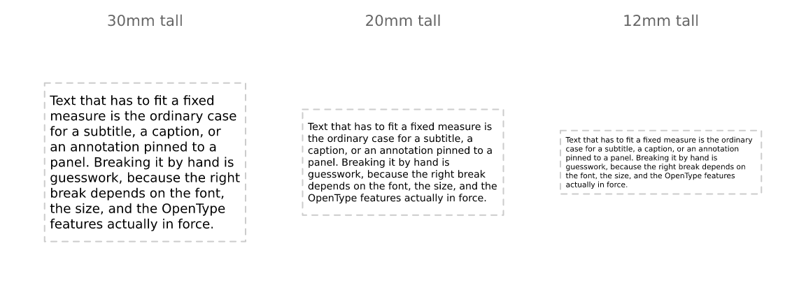
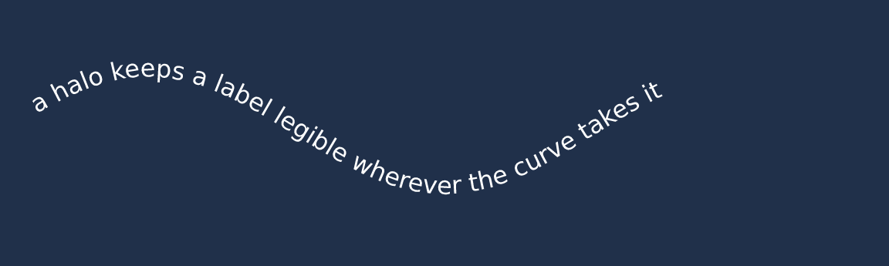
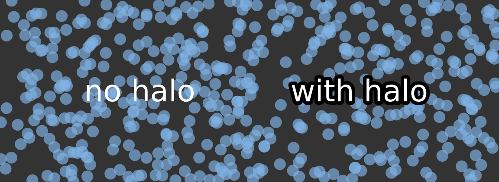

# Typography: layout, halos and OpenType features

vellum ships the shaper and the font tables in-process, and it measures
text when a scene is *built* rather than when it is drawn. Between them,
those two facts let it do things with text that R’s graphics stack
otherwise cannot: fit text to a box, set it along a curve, stroke the
glyph outlines, and ask the font for alternate glyphs.

## Text that fits a box

Give
[`text_grob()`](https://r-vellum.github.io/vellum/reference/grob.md) a
`width` and it wraps:

``` r

caption <- paste(
  "Text that has to fit a fixed measure is the ordinary case for a subtitle, a",
  "caption, or an annotation pinned to a panel. Breaking it by hand is guesswork,",
  "because the right break depends on the font, the size, and the OpenType",
  "features actually in force."
)

display(
  vl_scene(6, 1.8, dpi = 96, bg = "white") |>
    draw(rect_grob(width = vl_unit(80, "mm"), height = vl_unit(38, "mm"),
                   gp = vl_gpar(fill = "grey97", col = "grey85"))) |>
    draw(text_grob(caption, width = vl_unit(74, "mm"), gp = vl_gpar(fontsize = 9)))
)
```


The break decision is made on the **shaped** width of each candidate
line, not on a sum of per-word advances. Kerning and any active feature
are therefore accounted for, and a line can never render wider than it
measured — which is a guarantee, not a tendency, and is what makes
auto-fit below trustworthy.

`width` has to be an *absolute* unit (`mm`/`cm`/`in`/`pt`), and that
restriction is the interesting part. Wrapping happens when the grob is
constructed, and a viewport’s size in `npc` or `native` does not exist
until render time. Rather than pretend otherwise, vellum asks for the
physical measure you want to wrap to. A layout engine above vellum knows
its panel widths in millimetres, so this costs it nothing.

### Alignment

`align` positions lines within the box. Note that the block *is* a box
of exactly the requested width, so `just` anchors the box rather than
the longest line — which is what lets a right-aligned caption line up
with a panel edge.

``` r

box <- function(scene, x, align) {
  scene |>
    draw(rect_grob(x = x, y = 0.46, width = vl_unit(40, "mm"),
                   height = vl_unit(34, "mm"),
                   gp = vl_gpar(fill = "grey97", col = "grey85"))) |>
    draw(text_grob(sprintf('"%s"', align), x = x, y = 0.92,
                   gp = vl_gpar(fontsize = 9, col = "grey40"))) |>
    draw(text_grob(caption, x = x, y = 0.46, width = vl_unit(36, "mm"),
                   align = align, gp = vl_gpar(fontsize = 6)))
}
display(
  vl_scene(6, 2.6, dpi = 96, bg = "white") |>
    box(0.14, "left") |> box(0.38, "centre") |>
    box(0.62, "right") |> box(0.86, "justify")
)
```


`"justify"` stretches the inter-word spaces to flush both edges, leaving
the last line of each paragraph ragged — a two-word final line stretched
to full measure is the classic ugly artifact.

### Auto-fit

`fit = TRUE` shrinks the font — never grows it — until the wrapped block
fits `width` × `height`:

``` r

fitted <- vl_scene(6, 2.2, dpi = 96, bg = "white")
hs <- c(30, 20, 12)
for (i in seq_along(hs)) {
  x <- c(0.18, 0.5, 0.82)[i]
  fitted <- fitted |>
    draw(rect_grob(x = x, y = 0.45, width = vl_unit(38, "mm"),
                   height = vl_unit(hs[i], "mm"),
                   gp = vl_gpar(fill = NA, col = "grey80", lty = "dashed"))) |>
    draw(text_grob(caption, x = x, y = 0.45, width = vl_unit(36, "mm"),
                   height = vl_unit(hs[i] - 2, "mm"), fit = TRUE,
                   gp = vl_gpar(fontsize = 11))) |>
    draw(text_grob(paste0(hs[i], "mm tall"), x = x, y = 0.93,
                   gp = vl_gpar(fontsize = 8, col = "grey40")))
}
display(fitted)
```



Each probe re-wraps, because the line breaks depend on the size — this
is a search, not a scale factor. One size is chosen for the whole grob:
a row of labels at four different sizes is a defect, not a feature.

This is the piece that genuinely cannot be built on grid. Fitting text
to a box requires measuring it before it is drawn, and in grid a string
has no width until a device is open.

## Text on a path

[`text_path_grob()`](https://r-vellum.github.io/vellum/reference/text_path_grob.md)
takes a polyline baseline instead of a point. Each glyph keeps the pen
position shaping gave it and is placed that far along the path, rotated
to the local tangent.

``` r

arc <- function(from, to, r = 0.34) {
  th <- seq(from, to, length.out = 120)
  list(x = 0.5 + r * cos(th), y = 0.5 + r * sin(th))
}
upper <- arc(pi, 0)
lower <- arc(pi, 2 * pi) # reversed, so it reads the right way up

display(
  vl_scene(3.2, 3.2, dpi = 96, bg = "white") |>
    draw(circle_grob(r = 0.4, gp = vl_gpar(fill = NA, col = "grey75", lwd = 1.5))) |>
    draw(text_path_grob("MEASURED AT CONSTRUCTION", x = upper$x, y = upper$y,
                        offset = 5, gp = vl_gpar(fontsize = 10))) |>
    draw(text_path_grob("NOT AT DRAW TIME", x = lower$x, y = lower$y,
                        offset = -12, gp = vl_gpar(fontsize = 10))) |>
    draw(text_grob("vellum", gp = vl_gpar(fontsize = 14, col = "grey35")))
)
```


Two things to know.

Glyphs follow the tangent unconditionally, exactly as SVG `textPath`
does, so a label on the underside of a closed curve reads upside-down.
The fix is to reverse the **path**, as `lower` does above — not the
glyphs. Flipping glyphs individually would put them the right way up but
in reverse order, which is mirror-writing, so vellum does not offer it.

Arc length is measured on the *rendered* path, which is why this lives
in the engine rather than in R: glyph advances are in points and the
baseline is in `npc` or `native`, and nothing can put those in the same
space until the viewport’s pixel extent is known.

On-path text is an ordinary text node with a baseline attached, so
everything else still applies — halos, features, colour, clipping, and
all three backends. The run is fanned out into one glyph per position at
draw time, so SVG output is still real `<text>` and PDF still carries
copyable text:

``` r

x <- seq(0.04, 0.96, length.out = 200)
display(
  vl_scene(6, 1.8, dpi = 96, bg = "#20304A") |>
    draw(text_path_grob(
      "a halo keeps a label legible wherever the curve takes it",
      x = x, y = 0.5 + 0.22 * sin(x * 3 * pi), just = "left", offset = 3,
      gp = vl_gpar(fontsize = 12, col = "white",
                   halo_col = "#20304A", halo_width = 2.5)
    ))
)
```



## Halos

A label over a dense scatter, a photograph, or a map tile is hard to
read whatever colour you make it. The usual fix is a *halo* (or
“shadowtext”): the glyph outlines stroked in a contrasting colour
**underneath** the fill.

Packages that do this on top of grid draw the label eight times at small
offsets, because grid gives them no way to stroke a glyph. vellum has
the outlines, so it strokes them once:

``` r

set.seed(1)
n <- 500
cloud <- vl_scene(6, 2, dpi = 96, bg = "grey20") |>
  draw(points_grob(runif(n), runif(n), size = vl_unit(1.8, "mm"),
                   gp = vl_gpar(fill = "#7FB2E5AA", col = NA)))

display(
  cloud |>
    draw(text_grob("no halo", x = 0.28, y = 0.5,
                   gp = vl_gpar(fontsize = 26, col = "white"))) |>
    draw(text_grob("with halo", x = 0.72, y = 0.5,
                   gp = vl_gpar(fontsize = 26, col = "white",
                                halo_col = "black", halo_width = 3)))
)
```



`halo_width` is in **points**, like `fontsize`, so a halo keeps its
proportion at any dpi or figure size. Roughly an eighth of the font size
is a good starting point. A halo needs both `halo_col` and a positive
`halo_width`; either on its own does nothing.

The halo is drawn as a complete pass before any glyph is filled, so a
wide halo on one letter never paints over the neighbour that was already
drawn. All three backends agree: the raster and outline-SVG paths do the
two passes explicitly, native SVG uses `paint-order`, and PDF strokes
then fills.

Because a sprite bakes only the fill, haloed text always takes the exact
outline path — the glyph-bitmap fast path is bypassed for it. Halos are
usually a handful of labels, so this costs nothing in practice.

## OpenType features

A font often contains more glyphs than its default mapping exposes:
tabular figures, small caps, oldstyle numerals, alternate ligatures.
`features` takes a named vector of four-character OpenType tags and
passes them to the shaper.

``` r

kerned <- text_grob("AV Wa To Ty", x = 0.5, y = 0.72,
                    gp = vl_gpar(fontfamily = "Times", fontsize = 30))
loose <- text_grob("AV Wa To Ty", x = 0.5, y = 0.28,
                   gp = vl_gpar(fontfamily = "Times", fontsize = 30,
                                features = c(kern = 0)))
display(vl_scene(6, 2, dpi = 96) |> draw(kerned) |> draw(loose))
```


The tags worth knowing:

| tag | effect |
|----|----|
| `tnum` | tabular (fixed-width) figures — digits stop jittering between ticks |
| `onum` | oldstyle figures, which sit better in running text |
| `smcp` | small caps |
| `liga` | standard ligatures (`0` switches them off) |
| `kern` | kerning (`0` switches it off) |

**Tabular figures are the one to reach for first.** Proportional digits
make an axis label shift horizontally as its value changes, which reads
as jitter when a plot animates or a table updates. `c(tnum = 1)` fixes
that in one argument.

Two caveats. A feature the font does not carry is silently ignored —
that is HarfBuzz’s behaviour, and vellum cannot check it for you, so
compare output rather than assuming. And most system UI fonts already
ship tabular digits, so `tnum` is frequently a no-op; the features that
pay off tend to live in text faces and commercial fonts.

### Measurement follows features

Features change glyph widths, so a size measured without them would
reserve the wrong space.
[`vl_strwidth()`](https://r-vellum.github.io/vellum/reference/vl_strwidth.md),
[`vl_strheight()`](https://r-vellum.github.io/vellum/reference/vl_strwidth.md),
[`grobwidth()`](https://r-vellum.github.io/vellum/reference/grobwidth.md)
and
[`grobheight()`](https://r-vellum.github.io/vellum/reference/grobwidth.md)
all honour the same `features`, and the shape cache is keyed on them:

``` r

c(kerned = vl_strwidth("AV Wa To Ty", "Times", fontsize = 30, unit = "mm"),
  unkerned = vl_strwidth("AV Wa To Ty", "Times", fontsize = 30, unit = "mm",
                         features = c(kern = 0)))
#>   kerned unkerned 
#> 57.22166 61.41641
```

## Both together

Neither costs anything when unused: a scene with no halo and no features
renders byte-for-byte as it did before either existed.

``` r

display(
  vl_scene(6, 1.6, dpi = 96, bg = "#22303C") |>
    draw(text_grob("1,234.56", x = 0.5, y = 0.5,
                   gp = vl_gpar(fontfamily = "Times", fontsize = 34,
                                col = "#F5D76E", features = c(tnum = 1),
                                halo_col = "#101820", halo_width = 2.5)))
)
```


