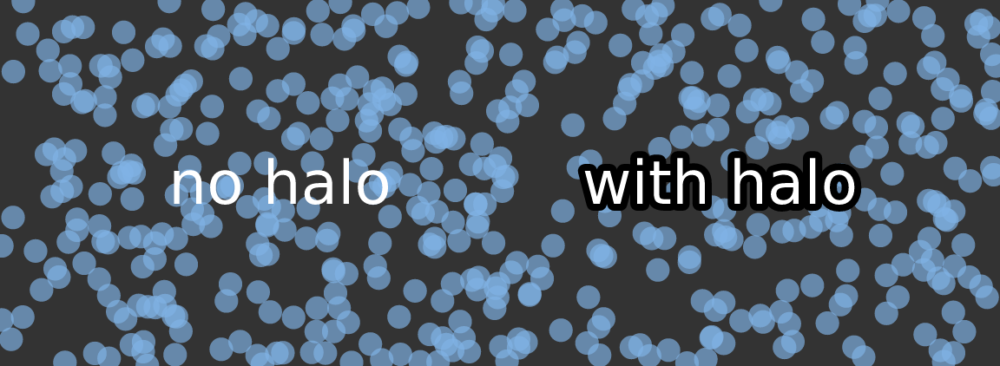
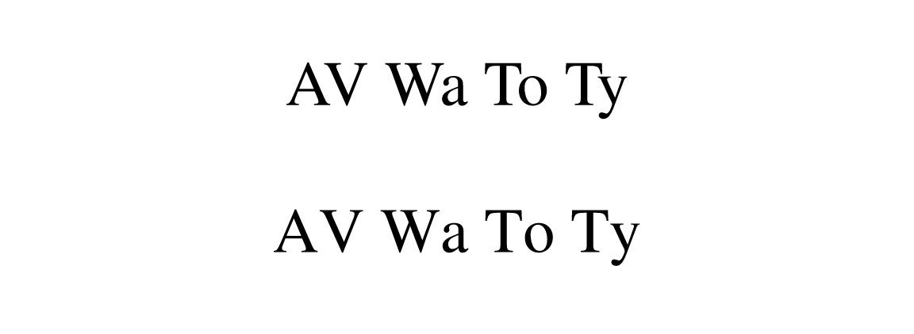
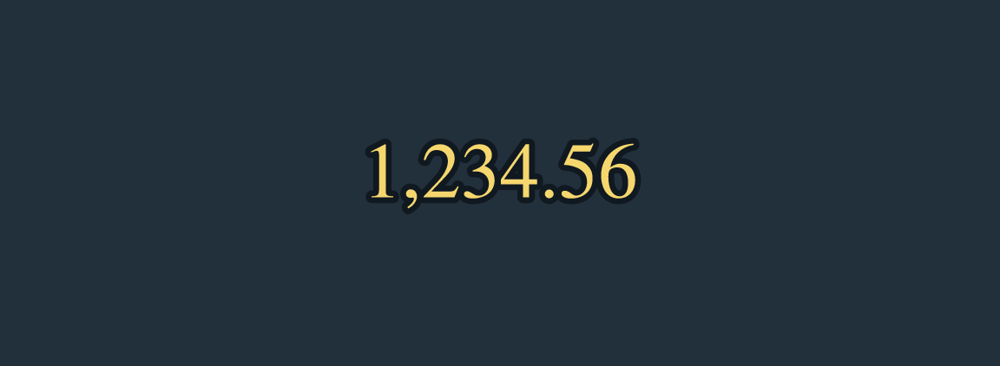

# Typography: halos and OpenType features

vellum ships the shaper and the font tables in-process, which means it
can do two things with text that R’s graphics stack otherwise cannot:
stroke the glyph outlines, and ask the font for alternate glyphs.

## Halos

A label over a dense scatter, a photograph, or a map tile is hard to
read whatever colour you make it. The usual fix is a *halo* (or
“shadowtext”): the glyph outlines stroked in a contrasting colour
**underneath** the fill.

Packages that do this on top of grid draw the label eight times at small
offsets, because grid gives them no way to stroke a glyph. vellum has
the outlines, so it strokes them once:

``` r

set.seed(1)
n <- 500
cloud <- vl_scene(6, 2, dpi = 96, bg = "grey20") |>
  draw(points_grob(runif(n), runif(n), size = vl_unit(1.8, "mm"),
                   gp = vl_gpar(fill = "#7FB2E5AA", col = NA)))

display(
  cloud |>
    draw(text_grob("no halo", x = 0.28, y = 0.5,
                   gp = vl_gpar(fontsize = 26, col = "white"))) |>
    draw(text_grob("with halo", x = 0.72, y = 0.5,
                   gp = vl_gpar(fontsize = 26, col = "white",
                                halo_col = "black", halo_width = 3)))
)
```



`halo_width` is in **points**, like `fontsize`, so a halo keeps its
proportion at any dpi or figure size. Roughly an eighth of the font size
is a good starting point. A halo needs both `halo_col` and a positive
`halo_width`; either on its own does nothing.

The halo is drawn as a complete pass before any glyph is filled, so a
wide halo on one letter never paints over the neighbour that was already
drawn. All three backends agree: the raster and outline-SVG paths do the
two passes explicitly, native SVG uses `paint-order`, and PDF strokes
then fills.

Because a sprite bakes only the fill, haloed text always takes the exact
outline path — the glyph-bitmap fast path is bypassed for it. Halos are
usually a handful of labels, so this costs nothing in practice.

## OpenType features

A font often contains more glyphs than its default mapping exposes:
tabular figures, small caps, oldstyle numerals, alternate ligatures.
`features` takes a named vector of four-character OpenType tags and
passes them to the shaper.

``` r

kerned <- text_grob("AV Wa To Ty", x = 0.5, y = 0.72,
                    gp = vl_gpar(fontfamily = "Times", fontsize = 30))
loose <- text_grob("AV Wa To Ty", x = 0.5, y = 0.28,
                   gp = vl_gpar(fontfamily = "Times", fontsize = 30,
                                features = c(kern = 0)))
display(vl_scene(6, 2, dpi = 96) |> draw(kerned) |> draw(loose))
```



The tags worth knowing:

| tag | effect |
|----|----|
| `tnum` | tabular (fixed-width) figures — digits stop jittering between ticks |
| `onum` | oldstyle figures, which sit better in running text |
| `smcp` | small caps |
| `liga` | standard ligatures (`0` switches them off) |
| `kern` | kerning (`0` switches it off) |

**Tabular figures are the one to reach for first.** Proportional digits
make an axis label shift horizontally as its value changes, which reads
as jitter when a plot animates or a table updates. `c(tnum = 1)` fixes
that in one argument.

Two caveats. A feature the font does not carry is silently ignored —
that is HarfBuzz’s behaviour, and vellum cannot check it for you, so
compare output rather than assuming. And most system UI fonts already
ship tabular digits, so `tnum` is frequently a no-op; the features that
pay off tend to live in text faces and commercial fonts.

### Measurement follows features

Features change glyph widths, so a size measured without them would
reserve the wrong space.
[`vl_strwidth()`](https://r-vellum.github.io/vellum/reference/vl_strwidth.md),
[`vl_strheight()`](https://r-vellum.github.io/vellum/reference/vl_strwidth.md),
[`grobwidth()`](https://r-vellum.github.io/vellum/reference/grobwidth.md)
and
[`grobheight()`](https://r-vellum.github.io/vellum/reference/grobwidth.md)
all honour the same `features`, and the shape cache is keyed on them:

``` r

c(kerned = vl_strwidth("AV Wa To Ty", "Times", fontsize = 30, unit = "mm"),
  unkerned = vl_strwidth("AV Wa To Ty", "Times", fontsize = 30, unit = "mm",
                         features = c(kern = 0)))
#>   kerned unkerned 
#> 57.22166 61.41641
```

## Both together

Neither costs anything when unused: a scene with no halo and no features
renders byte-for-byte as it did before either existed.

``` r

display(
  vl_scene(6, 1.6, dpi = 96, bg = "#22303C") |>
    draw(text_grob("1,234.56", x = 0.5, y = 0.5,
                   gp = vl_gpar(fontfamily = "Times", fontsize = 34,
                                col = "#F5D76E", features = c(tnum = 1),
                                halo_col = "#101820", halo_width = 2.5)))
)
```


