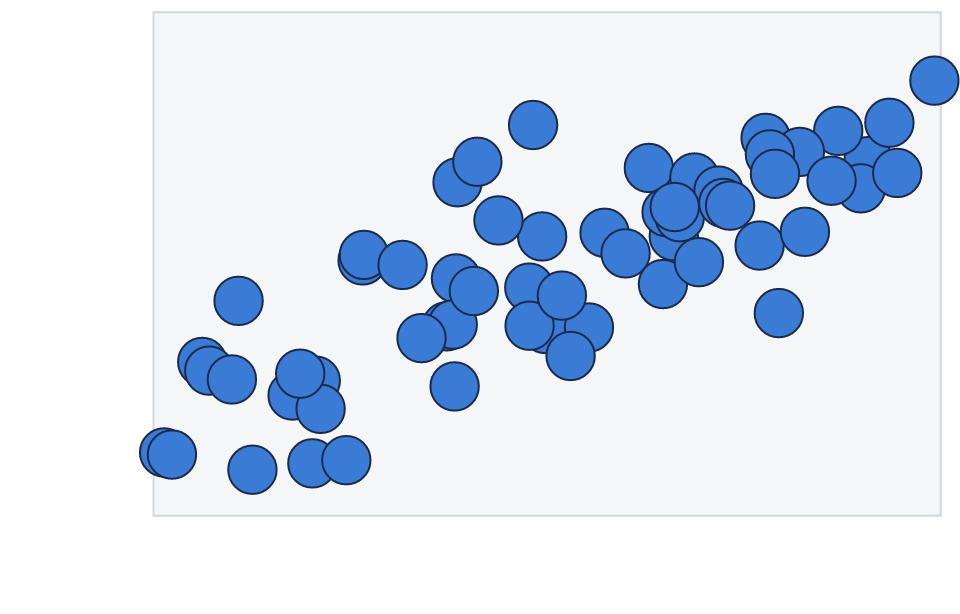

# Get started

vellum is a low-level graphics framework for R, in the spirit of grid,
with a Rust backend. You describe a scene with a small, declarative R
API; the scene graph, unit and layout engine, and rendering all run in
Rust; and the same scene renders to PNG, SVG, or PDF.

It is the foundation layer a grammar of graphics builds on, the way grid
underlies ggplot2. It is not a plotting package itself, so there are no
scales, stats, geoms, or facets here. What it gives you is the drawing
substrate: units, viewports, grobs, layout, and a deterministic
renderer.

``` r

library(vellum)
```

## A first scene

A scene starts with
[`vl_scene()`](https://r-vellum.github.io/vellum/reference/vl_scene.md),
which fixes the page size (in inches by default) and background. You
then add content with a pipeline of
[`draw()`](https://r-vellum.github.io/vellum/reference/vl_scene.md)
calls and show the result. Auto-printing a scene displays it, so the
last line of a chunk is enough.

``` r

vl_scene(width = 6, height = 3, bg = "white") |>
  draw(rect_grob(
    width = 0.94, height = 0.82,
    gp = vl_gpar(fill = linear_gradient(c("#1b2a4a", "#3a7bd5")), col = NA)
  )) |>
  draw(circle_grob(
    x = 0.16, y = 0.5, r = 0.28,
    gp = vl_gpar(fill = "#f7c948", col = NA)
  )) |>
  draw(text_grob(
    "vellum", x = 0.62, y = 0.5,
    gp = vl_gpar(fontsize = 48, col = "white", fontface = "bold")
  ))
```


Three ideas do most of the work here.

**Grobs** are the drawable primitives:
[`rect_grob()`](https://r-vellum.github.io/vellum/reference/grob.md),
[`circle_grob()`](https://r-vellum.github.io/vellum/reference/grob.md),
[`text_grob()`](https://r-vellum.github.io/vellum/reference/grob.md),
and a couple of dozen more (see
[`?grob`](https://r-vellum.github.io/vellum/reference/grob.md)). Each is
an immutable value object; building one draws nothing on its own.

**[`vl_gpar()`](https://r-vellum.github.io/vellum/reference/vl_gpar.md)**
carries the graphical parameters (fill, stroke colour, line width, font,
opacity) attached to a grob. A `fill` can be a plain colour or a
gradient, as above.

**Coordinates default to `"npc"`**: normalised parent coordinates, where
`(0, 0)` is the bottom-left of the region and `(1, 1)` the top-right. So
`x = 0.16` sits near the left edge and `y = 0.5` is vertically centred.

## Building a scene: push, draw, pop

A scene is a tree of viewports and grobs, built functionally.
[`push()`](https://r-vellum.github.io/vellum/reference/vl_scene.md)
descends into a new
[`vl_viewport()`](https://r-vellum.github.io/vellum/reference/vl_viewport.md),
[`draw()`](https://r-vellum.github.io/vellum/reference/vl_scene.md) adds
a grob at the current level, and
[`pop()`](https://r-vellum.github.io/vellum/reference/vl_scene.md)
ascends. A viewport is a rectangular region that establishes its own
coordinate systems, so once you push one with an `xscale` and `yscale`,
`"native"` units map data values straight onto the region.

``` r

set.seed(1)
x <- runif(60, 0, 10)
y <- 1.8 * x + rnorm(60, 0, 4)

vl_scene(5, 3.2, bg = "white") |>
  push(vl_viewport(
    x = 0.57, y = 0.57, width = 0.82, height = 0.82,
    xscale = c(0, 10), yscale = range(pretty(y))
  )) |>
  draw(rect_grob(gp = vl_gpar(fill = "#f4f6f8", col = "#cfd8dc"))) |>
  draw(points_grob(
    vl_unit(x, "native"), vl_unit(y, "native"),
    size = vl_unit(3.2, "mm"),
    gp = vl_gpar(fill = "#3a7bd5", col = "#1b2a4a", lwd = 1)
  )) |>
  pop()
```



The panel rectangle is drawn in `"npc"` (it fills its viewport), while
the points are placed in `"native"` units, so their positions follow the
data scales. A single
[`vl_unit()`](https://r-vellum.github.io/vellum/reference/vl_unit.md)
vector can even mix coordinate systems per axis. See
[`vignette("scene-and-paint")`](https://r-vellum.github.io/vellum/articles/scene-and-paint.md)
for the full picture of units, viewports, and the paint model.

## Rendering to a file

Displaying a scene is convenient while exploring. To write output, call
[`render()`](https://r-vellum.github.io/vellum/reference/vl_scene.md);
it picks the backend from the file extension.

``` r

s <- vl_scene(4, 3) |>
  draw(circle_grob(r = 0.3, gp = vl_gpar(fill = "tomato", col = NA)))

render(s, "out.png") # raster (tiny-skia)
render(s, "out.svg") # vector (hand-rolled SVG)
render(s, "out.pdf") # vector (krilla)
```

The same scene value renders to all three formats with consistent
geometry, and raster and PDF output is byte-stable, so it is
reproducible and snapshot-testable.

## Where to go next

- [`vignette("scene-and-paint")`](https://r-vellum.github.io/vellum/articles/scene-and-paint.md):
  the scene graph, units and viewports, and the paint model (gradients,
  patterns, masks).
- [`vignette("retained-mode")`](https://r-vellum.github.io/vellum/articles/retained-mode.md):
  because the scene graph is kept rather than drawn and forgotten, you
  can hit-test it and edit nodes by name.
- [`vignette("coming-from-grid")`](https://r-vellum.github.io/vellum/articles/coming-from-grid.md):
  a translation guide if you already know grid.
- [`vignette("grid-interop")`](https://r-vellum.github.io/vellum/articles/grid-interop.md):
  render existing grid, ggplot2, and lattice output through the vellum
  backend. \`\`\`
