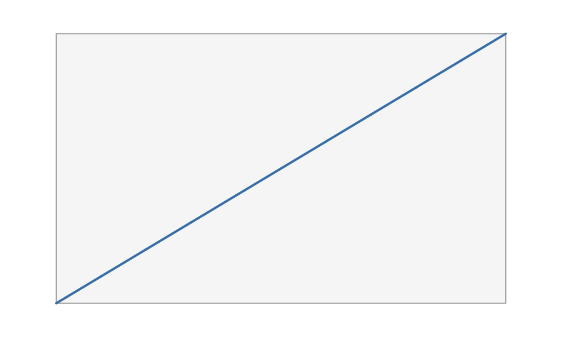

# Coming from grid

vellum sits at grid’s level of the stack: units, viewports, grobs,
layout, and rendering. If you know grid, most concepts carry over
directly. This guide maps the vocabulary and then flags the handful of
places where vellum works differently on purpose.

## The concept map

| grid | vellum | notes |
|----|----|----|
| [`grid.newpage()`](https://rdrr.io/r/grid/grid.newpage.html) | [`vl_scene()`](https://schochastics.github.io/vellum/reference/vl_scene.md) | vellum’s scene also fixes page size, background, and dpi up front |
| `unit(1, "native")` | `unit(1, "native")` | same idea; each element carries its own unit |
| [`viewport()`](https://schochastics.github.io/vellum/reference/viewport.md) | [`viewport()`](https://schochastics.github.io/vellum/reference/viewport.md) | region with its own `xscale` / `yscale` |
| [`pushViewport()`](https://rdrr.io/r/grid/viewports.html) / [`popViewport()`](https://rdrr.io/r/grid/viewports.html) | [`push()`](https://schochastics.github.io/vellum/reference/vl_scene.md) / [`pop()`](https://schochastics.github.io/vellum/reference/vl_scene.md) | functional: they take and return a scene, no global stack |
| [`grid.rect()`](https://rdrr.io/r/grid/grid.rect.html), [`grid.circle()`](https://rdrr.io/r/grid/grid.circle.html), … | [`rect_grob()`](https://schochastics.github.io/vellum/reference/grob.md), [`circle_grob()`](https://schochastics.github.io/vellum/reference/grob.md), … plus [`draw()`](https://schochastics.github.io/vellum/reference/vl_scene.md) | the constructor builds a value; [`draw()`](https://schochastics.github.io/vellum/reference/vl_scene.md) adds it |
| [`rectGrob()`](https://rdrr.io/r/grid/grid.rect.html), [`gTree()`](https://rdrr.io/r/grid/grid.grob.html) | [`rect_grob()`](https://schochastics.github.io/vellum/reference/grob.md), the scene tree | grobs are immutable S7 values |
| [`gpar()`](https://schochastics.github.io/vellum/reference/gpar.md) | [`gpar()`](https://schochastics.github.io/vellum/reference/gpar.md) | familiar fields; `fill` also accepts gradients |
| [`grid.layout()`](https://rdrr.io/r/grid/grid.layout.html) | [`grid_layout()`](https://schochastics.github.io/vellum/reference/viewport.md) | flexible `"null"` tracks work the same |
| [`grid.edit()`](https://rdrr.io/r/grid/grid.edit.html) / [`editGrob()`](https://rdrr.io/r/grid/grid.edit.html) | [`edit_node()`](https://schochastics.github.io/vellum/reference/node_names.md) | edit by `name`; copy-on-modify, not in place |
| [`grid.grabExpr()`](https://rdrr.io/r/grid/grid.grab.html) / display list | the retained scene | the tree is the model; nothing is replayed |
| [`grid.locator()`](https://rdrr.io/r/grid/grid.locator.html) | [`hit_test()`](https://schochastics.github.io/vellum/reference/hit_test.md) | exact geometric picking, not one interactive click |
| device ([`png()`](https://rdrr.io/r/grDevices/png.html), [`pdf()`](https://rdrr.io/r/grDevices/pdf.html), …) | `render(scene, path)` | the extension picks the backend |

## Side by side

A minimal grid plot and its vellum translation. In grid:

``` r

library(grid)
grid.newpage()
pushViewport(viewport(width = 0.8, height = 0.8,
                      xscale = c(0, 10), yscale = c(0, 20)))
grid.rect(gp = gpar(fill = "grey97", col = "grey70"))
grid.lines(x = unit(0:10, "native"), y = unit((0:10) * 2, "native"),
           gp = gpar(col = "steelblue", lwd = 2))
popViewport()
```

The same scene in vellum:

``` r

vl_scene(5, 3, bg = "white") |>
  push(viewport(width = 0.8, height = 0.8,
                xscale = c(0, 10), yscale = c(0, 20))) |>
  draw(rect_grob(gp = gpar(fill = "grey97", col = "grey70"))) |>
  draw(lines_grob(x = unit(0:10, "native"), y = unit((0:10) * 2, "native"),
                  gp = gpar(col = "steelblue", lwd = 2))) |>
  pop()
```



The shapes are the same; the difference is that the vellum version is
one expression that returns a scene value, with no global device or
viewport stack mutated along the way.

## What is different, and why

### The builder is functional, not stateful

grid keeps a global viewport stack and a display list:
[`pushViewport()`](https://rdrr.io/r/grid/viewports.html) mutates state,
and each `grid.*` call paints into the current device. vellum’s
[`push()`](https://schochastics.github.io/vellum/reference/vl_scene.md),
[`draw()`](https://schochastics.github.io/vellum/reference/vl_scene.md),
and
[`pop()`](https://schochastics.github.io/vellum/reference/vl_scene.md)
each take a scene and return a new one. There is no “current viewport”
to lose track of, the pipe *is* the tree, and a scene is an ordinary
value you can store, pass around, and branch from.

### Metrics are eager, so there is no draw-time hook protocol

grid cannot know a grob’s size until a device and viewport exist at draw
time, which is why it has lazy units and the `makeContext` /
`makeContent` / `widthDetails` hook protocol, and why it replays the
whole display list on resize. vellum resolves text and object metrics in
process, up front, so a grob knows its extent when you build it. You
measure with
[`vl_strwidth()`](https://schochastics.github.io/vellum/reference/vl_strwidth.md)
or size a unit by a grob’s extent with
[`grobwidth()`](https://schochastics.github.io/vellum/reference/grobwidth.md)
/
[`grobheight()`](https://schochastics.github.io/vellum/reference/grobwidth.md)
immediately, without an open device.

### Units resolve eagerly, and mixed-unit arithmetic is restricted

Because units resolve eagerly to a flat representation, vellum will
*not* defer `unit(1, "npc") - unit(2, "mm")` the way grid does.
Same-space arithmetic and absolute-plus-absolute both work
(`unit(10, "mm") + unit(1, "in")` gives `35.4mm`), but mixing a relative
and an absolute unit in one expression is reported rather than guessed.

``` r

unit(10, "mm") + unit(1, "in") # absolute + absolute -> mm
#> <vellum_unit[1]>
#> [1] 35.4mm
unit(1:3, "cm") * 2            # scaling is fine
#> <vellum_unit[3]>
#> [1] 20mm 40mm 60mm
```

If you have grid code that offsets a relative position by an absolute
amount, compose it at the viewport or native level instead of in a
single `unit` expression. This is the change most likely to surface when
porting grid code.

### The tree is retained and inspectable

grid’s rendered output is pixels plus a display list. vellum keeps the
scene as an immutable tree you can query and edit after the fact:
[`node_names()`](https://schochastics.github.io/vellum/reference/node_names.md),
[`get_node()`](https://schochastics.github.io/vellum/reference/node_names.md),
[`edit_node()`](https://schochastics.github.io/vellum/reference/node_names.md),
[`hit_test()`](https://schochastics.github.io/vellum/reference/hit_test.md),
and
[`scene_model()`](https://schochastics.github.io/vellum/reference/scene_model.md).
There is no [`grid.force()`](https://rdrr.io/r/grid/grid.force.html)
step, and editing a node copies rather than mutating in place. See
[`vignette("retained-mode")`](https://schochastics.github.io/vellum/articles/retained-mode.md)
for what this enables.

### `gpar` inherits, but there is no cascade

[`gpar()`](https://schochastics.github.io/vellum/reference/gpar.md)
inheritance works as in grid: a field left `NULL` is inherited from the
enclosing viewport, and `alpha` multiplies down the tree. vellum does
not add a CSS-like cascade with selectors or theme objects at this
layer; that is a grammar-layer concern.

## Do I have to rewrite my grid code?

Not necessarily. If you already have grid, ggplot2, or lattice output,
you can render it *through* vellum’s backend without porting anything,
using
[`as_vellum()`](https://schochastics.github.io/vellum/reference/as_vellum.md)
and
[`render_grid()`](https://schochastics.github.io/vellum/reference/as_vellum.md).
See
[`vignette("grid-interop")`](https://schochastics.github.io/vellum/articles/grid-interop.md).
Rewriting in the native API is worth it when you want the retained-tree
features (naming, editing, hit-testing) or deterministic multi-backend
output. \`\`\`
