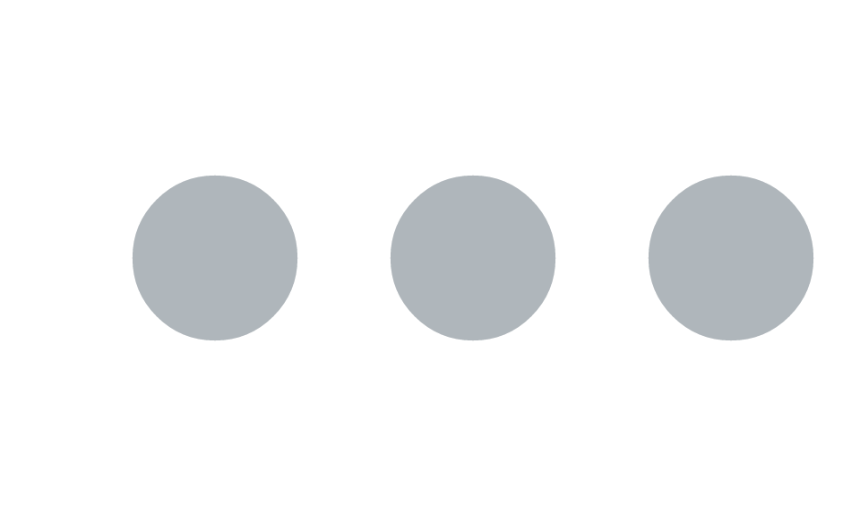

# Retained-mode superpowers: hit-testing and editable nodes

grid, and most drawing APIs, are *immediate mode*: a call paints pixels
and forgets everything about them. vellum is *retained mode*. The scene
you build is kept as a tree until you render it, and that tree can be
queried and edited afterwards. This article shows the three things that
buys you: naming and editing nodes, hit-testing, and reading back a
per-element model of the scene.

## Naming nodes

Every grob and viewport takes an optional `name`. A name turns a node
into something you can look up and modify later.

``` r

dots <- vl_scene(5, 3, bg = "white") |>
  draw(circle_grob(x = 0.25, y = 0.5, r = 0.16, name = "a",
                   gp = gpar(fill = "#bdc3c7", col = NA))) |>
  draw(circle_grob(x = 0.55, y = 0.5, r = 0.16, name = "b",
                   gp = gpar(fill = "#bdc3c7", col = NA))) |>
  draw(circle_grob(x = 0.85, y = 0.5, r = 0.16, name = "c",
                   gp = gpar(fill = "#bdc3c7", col = NA)))

node_names(dots)
#> [1] "a" "b" "c"
```

[`node_names()`](https://schochastics.github.io/vellum/reference/node_names.md)
lists the names in paint order, and
[`get_node()`](https://schochastics.github.io/vellum/reference/node_names.md)
returns the node itself, so you can inspect a value you built earlier.

``` r

get_node(dots, "b")
#> <vellum::grob_circle>
#>  @ name  : chr "b"
#>  @ gp    : <vellum::gpar>
#>  .. @ col       : logi NA
#>  .. @ fill      : chr "#bdc3c7"
#>  .. @ lwd       : NULL
#>  .. @ alpha     : NULL
#>  .. @ lty       : NULL
#>  .. @ lineend   : NULL
#>  .. @ linejoin  : NULL
#>  .. @ linemitre : NULL
#>  .. @ fontfamily: NULL
#>  .. @ fontface  : NULL
#>  .. @ fontsize  : NULL
#>  .. @ lineheight: NULL
#>  @ vp    : NULL
#>  @ id    : NULL
#>  @ role  : NULL
#>  @ keys  : NULL
#>  @ meta  : NULL
#>  @ x     : unit [1:1] 0.55npc
#>  @ y     : unit [1:1] 0.5npc
#>  @ r     : unit [1:1] 0.16npc
#>  @ sketch: NULL
```

## Editing a node

[`edit_node()`](https://schochastics.github.io/vellum/reference/node_names.md)
returns a *new* scene with one node’s properties changed. It is
copy-on-modify: the original scene value is untouched, so you can derive
variants without disturbing the source. Here we highlight the middle
dot.

``` r

highlighted <- edit_node(dots, "b", gp = gpar(fill = "#e74c3c", col = NA))
highlighted
```


The original is unchanged:

``` r

dots
```



This is the mechanism a host uses for hover and selection: keep one
scene, and on an interaction re-derive it with the touched node
restyled, then re-render. Flagging that node’s viewport with
`cache = TRUE` (a repaint boundary) makes the re-render cheap, since
only the changed subtree is re-rasterised.

## Hit-testing

[`hit_test()`](https://schochastics.github.io/vellum/reference/hit_test.md)
answers the inverse question: given a point, which node is drawn on top
there? grid offers only
[`grid.locator()`](https://rdrr.io/r/grid/grid.locator.html), but a
retained scene can be compiled into a colour pick-buffer, so the answer
is exact with respect to geometry, clipping, and paint order.
Coordinates default to `"npc"` (`0..1`, y up); pass `units = "px"` for
device pixels.

``` r

hit_test(dots, x = 0.25, y = 0.5) # over dot "a"
#> [1] "a"
hit_test(dots, x = 0.55, y = 0.5) # over dot "b"
#> [1] "b"
hit_test(dots, x = 0.05, y = 0.1) # empty space
#> NULL
```

A point over a named grob returns its name; over an unnamed grob it
returns `NA`; over blank canvas it returns `NULL`. That is enough to
route a click back to the datum that drew the mark.

## A per-element model of the scene

[`hit_test()`](https://schochastics.github.io/vellum/reference/hit_test.md)
picks one node;
[`scene_model()`](https://schochastics.github.io/vellum/reference/scene_model.md)
returns the whole picture. It walks a rendered scene and returns one row
per drawn element of the *keyable* marks (points, circles, rects,
hexagons, sectors, segments), pairing each element’s identity with its
resolved device-pixel bounding box.

``` r

sm <- scene_model(dots)
str(sm, max.level = 1)
#> List of 2
#>  $ elements:'data.frame':    3 obs. of  14 variables:
#>  $ panels  :'data.frame':    0 obs. of  5 variables:
sm$elements[, c("mark", "name", "x", "y", "w", "h")]
#>     mark name   x   y     w     h
#> 1 circle    a 120 144 92.16 92.16
#> 2 circle    b 264 144 92.16 92.16
#> 3 circle    c 408 144 92.16 92.16
```

The real power shows up when marks carry a data `key` (and optional
free-form `meta`), which the batched grobs accept per element. The `key`
is emitted by the SVG backend as `data-key` on each element and surfaced
here, so a host can render the SVG once
([`scene_svg()`](https://schochastics.github.io/vellum/reference/scene_svg.md)),
then use this table to map a DOM event back to the originating row of
data.

``` r

keyed <- vl_scene(5, 3, bg = "white") |>
  draw(points_grob(
    x = unit(c(0.25, 0.55, 0.85), "npc"), y = 0.5,
    size = unit(6, "mm"),
    key = c("row-1", "row-2", "row-3"),
    gp = gpar(fill = "#3a7bd5", col = NA)
  ))

scene_model(keyed)$elements[, c("mark", "key", "x", "y")]
#>    mark   key   x   y
#> 1 point row-1 120 144
#> 2 point row-2 264 144
#> 3 point row-3 408 144
```

## Why this matters

The retained scene graph is what separates vellum from an immediate-mode
drawing layer. Because the tree survives past construction:

- nodes can be **named, inspected, and edited**
  ([`node_names()`](https://schochastics.github.io/vellum/reference/node_names.md),
  [`get_node()`](https://schochastics.github.io/vellum/reference/node_names.md),
  [`edit_node()`](https://schochastics.github.io/vellum/reference/node_names.md))
  without rebuilding the scene;
- any point can be **hit-tested** back to the node that drew it
  ([`hit_test()`](https://schochastics.github.io/vellum/reference/hit_test.md));
- the whole scene can be read back as a **table of elements with keys
  and geometry**
  ([`scene_model()`](https://schochastics.github.io/vellum/reference/scene_model.md)),
  the host-agnostic bridge to interactivity.

These are the primitives an interactive grammar layer builds tooltips,
brushing, and linked selection on top of. \`\`\`
