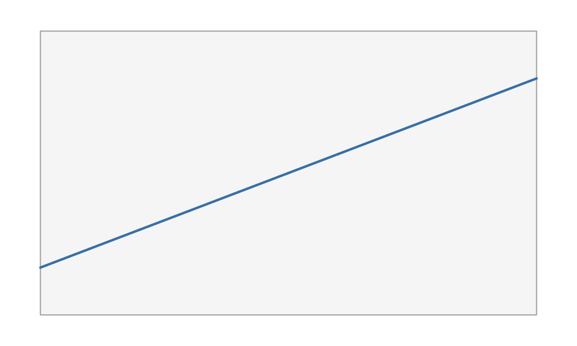
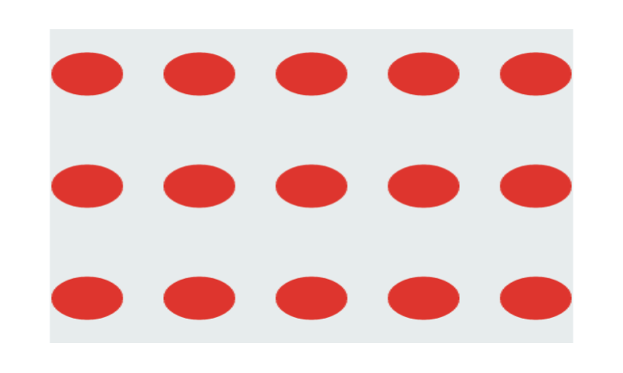
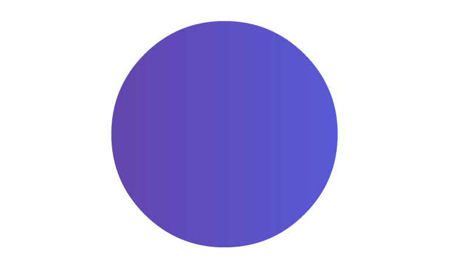

# The scene graph and the paint model

This article covers the two pieces you spend most of your time with in
vellum: the **scene graph** (units, viewports, and the tree they form)
and the **paint model** (gradients, patterns, and masks) shared across
every backend.

## The scene graph

A vellum scene is a tree. The root is the page created by
[`vl_scene()`](https://schochastics.github.io/vellum/reference/vl_scene.md);
every
[`push()`](https://schochastics.github.io/vellum/reference/vl_scene.md)
adds a
[`viewport()`](https://schochastics.github.io/vellum/reference/viewport.md)
child and descends into it; every
[`draw()`](https://schochastics.github.io/vellum/reference/vl_scene.md)
appends a grob at the current level;
[`pop()`](https://schochastics.github.io/vellum/reference/vl_scene.md)
climbs back up. The tree is retained, not drawn-and-forgotten, which is
what enables the queries in
[`vignette("retained-mode")`](https://schochastics.github.io/vellum/articles/retained-mode.md).

Because it is a tree, viewports nest, and a child’s geometry is
expressed relative to its parent. That is the whole mechanism behind
panels, insets, and faceting: push a viewport for a sub-region, draw
inside it in local coordinates, then pop.

``` r

vl_scene(6, 2.4, bg = "white") |>
  # a full-width band
  draw(rect_grob(height = 0.6, gp = gpar(fill = "#eef2f6", col = NA))) |>
  # an inset viewport occupying the middle third
  push(viewport(x = 0.5, width = 1 / 3, height = 0.8)) |>
  draw(rect_grob(gp = gpar(fill = "#3a7bd5", col = NA))) |>
  draw(text_grob("inset", gp = gpar(col = "white", fontface = "bold"))) |>
  pop()
```


## Units

Coordinates and sizes are
[`unit()`](https://schochastics.github.io/vellum/reference/unit.md)
vectors: a value paired with a unit name. Each element carries its own
unit, so one vector can mix coordinate systems, and a grob can even use
different units on its x and y axes.

The units you reach for most:

- `"npc"` (the default): normalised parent coordinates, `0` at
  bottom/left and `1` at top/right of the current viewport.
- `"native"`: the enclosing viewport’s `xscale` / `yscale`, so data
  values map directly. This is what you use for plotted data.
- `"mm"`, `"cm"`, `"in"`, `"pt"`: absolute physical lengths that keep
  their size regardless of the viewport.

A bare number is interpreted in the grob’s default units (usually
`"npc"`), so `x = 0.5` and `x = unit(0.5, "npc")` are the same thing.

``` r

unit(1:3, "native")
#> <vellum_unit[3]>
#> [1] 1native 2native 3native
unit(c(0.5, 1), c("npc", "in"))
#> <vellum_unit[2]>
#> [1] 0.5npc 1.0in
```

`"native"` units need a viewport with scales to resolve against. Set
`xscale` and `yscale` when you push:

``` r

vl_scene(5, 3, bg = "white") |>
  push(viewport(
    width = 0.86, height = 0.82,
    xscale = c(0, 10), yscale = c(-5, 25)
  )) |>
  draw(rect_grob(gp = gpar(fill = "grey97", col = "grey70"))) |>
  draw(lines_grob(
    x = unit(0:10, "native"),
    y = unit((0:10) * 2, "native"),
    gp = gpar(col = "steelblue", lwd = 2)
  )) |>
  pop()
```



Absolute and relative units compose within a viewport, and font- or
string-relative units (`"char"`, `"line"`, `"strwidth"`) resolve to
millimetres at construction. Mixing a relative and an absolute unit in a
single arithmetic expression (say `unit(1, "npc") - unit(2, "mm")`) is
deferred and reported rather than silently guessed, so an ambiguous
offset fails loudly instead of drawing in the wrong place.

## The paint model

Any `fill` in
[`gpar()`](https://schochastics.github.io/vellum/reference/gpar.md) can
be more than a flat colour. The same three paint types work identically
on the raster, SVG, and PDF backends (with the documented exception that
the PDF backend does not yet rasterise patterns).

### Gradients

[`linear_gradient()`](https://schochastics.github.io/vellum/reference/gradients.md)
and
[`radial_gradient()`](https://schochastics.github.io/vellum/reference/gradients.md)
interpolate between colour stops. Their geometry is given in a
coordinate system (`"npc"` by default) and is resolved against the
viewport at draw time, so a gradient transforms with its grob just like
the outline does.

``` r

vl_scene(6, 2.2, bg = "white") |>
  push(viewport(x = 0.28, width = 0.44)) |>
  draw(rect_grob(
    width = 0.8, height = 0.7,
    gp = gpar(fill = linear_gradient(c("#1b2a4a", "#3a7bd5")), col = NA)
  )) |>
  pop() |>
  push(viewport(x = 0.72, width = 0.44)) |>
  draw(circle_grob(
    r = 0.34,
    gp = gpar(fill = radial_gradient(c("#f6d365", "#fda085")), col = NA)
  )) |>
  pop()
```


### Patterns

[`pattern()`](https://schochastics.github.io/vellum/reference/pattern.md)
fills a shape by tiling a grob (or a list of grobs). The tile is
authored in the unit square and repeated across a cell whose size you
choose.

``` r

tile <- list(
  rect_grob(gp = gpar(fill = "#ecf0f1", col = NA)),
  circle_grob(r = 0.32, gp = gpar(fill = "#e74c3c", col = NA))
)

vl_scene(4, 2.4, bg = "white") |>
  draw(rect_grob(
    width = 0.84, height = 0.84,
    gp = gpar(fill = pattern(tile, width = 0.18, height = 0.3), col = NA)
  ))
```



### Masks and group opacity

A mask is a grob whose coverage modulates the visibility of a viewport’s
contents. Wrap it with
[`as_mask()`](https://schochastics.github.io/vellum/reference/as_mask.md)
and pass it to `viewport(mask = ...)`. Here a linear gradient is clipped
to a circular alpha mask.

``` r

vl_scene(4, 2.4, bg = "white") |>
  push(viewport(
    mask = as_mask(circle_grob(r = 0.42, gp = gpar(fill = "white", col = NA)))
  )) |>
  draw(rect_grob(gp = gpar(fill = linear_gradient(c("#7f53ac", "#647dee")), col = NA))) |>
  pop()
```



Related to masks is **group opacity**. Setting `viewport(alpha = ...)`
composites the viewport’s contents as a single isolated layer at that
opacity, so overlapping elements do not accumulate the way per-element
`gpar(alpha = )` would. That distinction (compositing a group versus
fading each mark) is exactly the kind of control a grammar layer needs
from its backend.

## Recap

- A scene is a retained tree of nested viewports and grobs, built with
  [`push()`](https://schochastics.github.io/vellum/reference/vl_scene.md)
  /
  [`draw()`](https://schochastics.github.io/vellum/reference/vl_scene.md)
  /
  [`pop()`](https://schochastics.github.io/vellum/reference/vl_scene.md).
- [`unit()`](https://schochastics.github.io/vellum/reference/unit.md)
  vectors express geometry; `"npc"` is relative to the viewport,
  `"native"` follows the data scales, and `"mm"` and friends are
  absolute.
- `gpar(fill = )` accepts gradients and patterns, and
  [`viewport()`](https://schochastics.github.io/vellum/reference/viewport.md)
  accepts masks, group opacity, and blend modes, all consistent across
  backends.

Next, see
[`vignette("retained-mode")`](https://schochastics.github.io/vellum/articles/retained-mode.md)
for what the retained tree lets you do after it is built. \`\`\`
